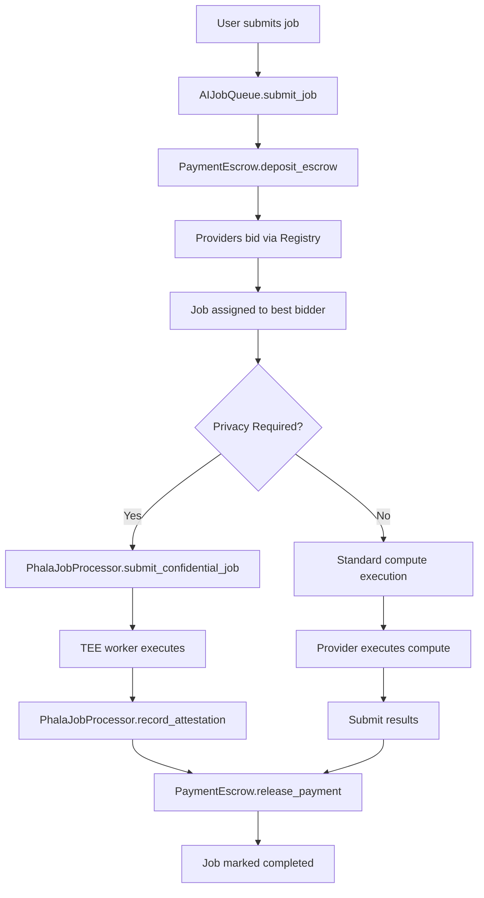
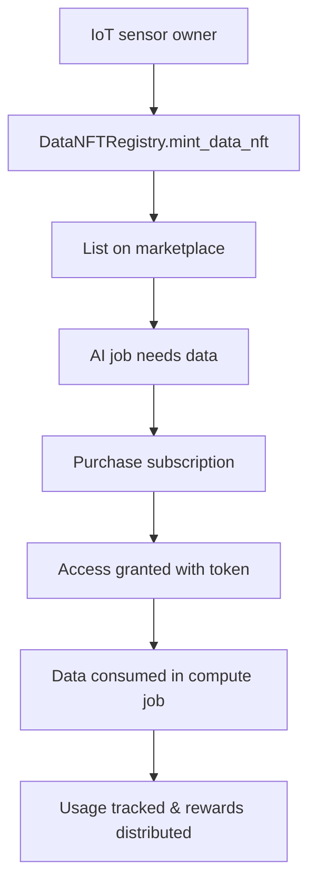
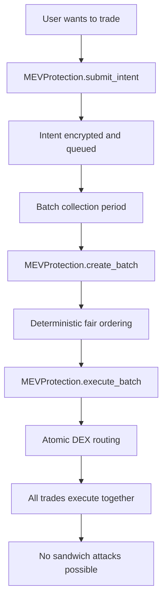
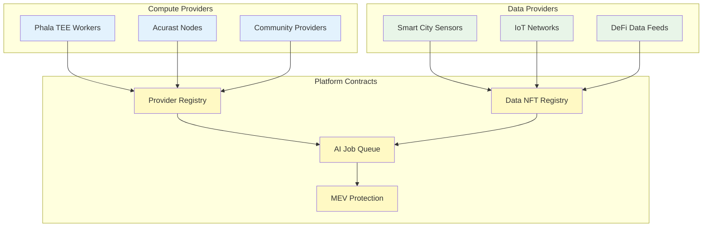

# PolkaMesh Smart Contracts

## 🚀 Overview

PolkaMesh is a decentralized AI compute and data marketplace built on Polkadot that enables:

- **AI Job Submission & Execution**: Decentralized compute for ML inference and training
- **Data Marketplace**: IoT/DePIN data monetization through Data NFTs
- **Cross-Chain Payments**: XCM-enabled escrow and settlement
- **Privacy-First Compute**: ZK attestation and confidential compute integration
- **MEV Protection**: Intent-based trading and fair batch execution
- **Reputation System**: Provider scoring and anti-Sybil mechanisms

## 📁 Contract Architecture

Our modular approach consists of **six main contracts**:

```
PolkaMesh-Contracts/
├── ai_job_queue/                # Core job submission and lifecycle
├── payment_escrow/              # Cross-chain escrow and settlement
├── compute_provider_registry/   # Provider registration and bidding
├── data_nft_registry/           # IoT data tokenization and access
├── phala_job_processor/         # Confidential TEE job execution
├── mev_protection/              # Intent-based MEV prevention
└── README.md                    # This file
```

## 🌐 Deployed Contract Addresses (Paseo Testnet)

| Contract                | Address                                            | Code Hash               |
| ----------------------- | -------------------------------------------------- | ----------------------- |
| **Payment Escrow**      | `0x5a86a13ef7fc1c5e58f022be183de015dfb702ae`       | `0x7bfff2dbd2e6783b...` |
| **AI Job Queue**        | `0xa44639cd0d0e6c6607491088c9c549e184456122`       | `0xbcfb1802a1260d9e...` |
| **Provider Registry**   | `0x2c6fc00458f198f46ef072e1516b83cd56db7cf5`       | `0xbec9c69919bb7c8f...` |
| **Data NFT Registry**   | `0x6dc84ddeffccb19ed5285cf3c3d7b03a57a9a4b1`       | `0x039a46c338d197ee...` |
| **Phala Job Processor** | `5HrKZAiTSAFcuxda89kSD77ZdygRUkufwRnGKgfGFR4NC2np` | `0x7086fddde65c083d...` |
| **MEV Protection**      | `5DTPZHSHydkPQZbTFrhnHtZiDER7uoKSzdYHuCUXVAtjajXs` | `0x9949de08fb997faf...` |

> **Network**: Paseo Pop Testnet  
> **RPC**: `wss://rpc1.paseo.popnetwork.xyz`  
> **Last Updated**: November 2024

## 🏗️ Contract Details

### 1. **AI Job Queue** (`ai_job_queue/`)

**Purpose**: Core job submission, queue management, and lifecycle tracking

**Key Features**:

- Job registration with detailed specs (model, data, compute requirements)
- Status tracking: `Registered → Assigned → InProgress → Completed/Disputed`
- Deadline enforcement and privacy flags
- Event emission for off-chain monitoring

**Main Functions**:

```rust
submit_job(model_ref, data_ref, compute_type, deadline, privacy) -> job_id
get_job(job_id) -> Job
assign_provider(job_id, provider) -> bool
mark_completed(job_id) -> bool
```

**Use Cases**:

- DApp submits ML inference job with payment
- City requests traffic prediction using IoT data
- DEX submits anti-MEV analysis job

---

### 2. **Payment Escrow** (`payment_escrow/`)

**Purpose**: Secure payment handling, cross-chain settlement via XCM

**Key Features**:

- Escrow deposits when jobs are submitted
- Payment release on job completion (with attestation)
- Refund mechanism for disputes/failures
- Multi-token support (DOT, parachain tokens, stablecoins)

**Main Functions**:

```rust
deposit_escrow(job_id, amount) -> bool
release_payment(job_id, provider) -> bool
refund_payment(job_id, reason) -> bool
get_escrow_balance(job_id) -> Balance
```

**Security Features**:

- Only authorized verifiers can release payments
- Dispute resolution with governance hooks
- Automatic refunds for missed deadlines

---

### 3. **Compute Provider Registry** (`compute_provider_registry/`)

**Purpose**: Provider onboarding, capability management, and bidding system

**Key Features**:

- Provider registration with capabilities (GPU, CPU, Phala TEE, etc.)
- Reputation tracking and scoring
- Bidding system with SLA commitments
- Stake-based Sybil resistance

**Main Functions**:

```rust
register_provider(capabilities, stake) -> bool
submit_bid(job_id, price, sla_commitment) -> bool
update_reputation(provider, score_delta) -> bool
get_provider_info(provider) -> ProviderInfo
```

**Provider Types**:

- **Phala Network**: Confidential compute via TEE/SGX
- **Acurast**: Decentralized cloud compute
- **Community Nodes**: General purpose compute providers

---

### 4. **Data NFT Registry** (`data_nft_registry/`)

**Purpose**: IoT data tokenization, access control, and monetization

**Key Features**:

- Data stream tokenization as NFTs
- Subscription-based access control
- Usage tracking and payment distribution
- Privacy-preserving metadata storage

**Main Functions**:

```rust
mint_data_nft(metadata, access_policy) -> nft_id
purchase_subscription(nft_id, duration) -> bool
access_data(nft_id, proof_of_payment) -> access_token
get_data_usage_stats(nft_id) -> UsageStats
```

**Data Types**:

- **Smart City**: Traffic, energy, weather, pollution sensors
- **IoT Networks**: Industrial sensors, consumer devices
- **Financial Data**: DeFi metrics, cross-chain analytics

---

### 5. **Phala Job Processor** (`phala_job_processor/`)

**Purpose**: Confidential job execution with TEE attestation verification

**Key Features**:

- Encrypted job parameter submission
- TEE worker attestation tracking
- Cryptographic proof verification
- Result integrity validation

**Main Functions**:

```rust
submit_confidential_job(encrypted_payload, public_key) -> job_id
record_attestation(job_id, result_hash, attestation_proof) -> bool
get_job_status(job_id) -> ConfidentialJob
verify_attestation(job_id) -> JobAttestation
```

**Data Structures**:

- **ConfidentialJob**: Encrypted job with owner verification
- **JobAttestation**: Cryptographic proof from TEE workers

**Security Model**:

- End-to-end encryption for sensitive data
- TEE worker public key verification
- Attestation proof validation

---

### 6. **MEV Protection** (`mev_protection/`)

**Purpose**: Prevents Maximal Extractable Value attacks through intent-based ordering

**Key Features**:

- Encrypted intent submission
- Fair batch execution
- Sandwich attack prevention
- Deterministic ordering
- DEX routing integration

**Main Functions**:

```rust
submit_intent(encrypted_intent, token_in, token_out, min_output) -> intent_id
create_batch(intent_ids, execution_route) -> batch_id
execute_batch(batch_id) -> BatchResult
get_batch_stats() -> BatchStatistics
```

**Protection Mechanisms**:

- **Intent Encryption**: Orders submitted encrypted
- **Fair Batching**: Deterministic intent grouping
- **Atomic Execution**: All-or-nothing batch processing
- **No Front-running**: Block builders cannot reorder

## 🔄 System Interactions

### Complete AI Job Flow



### Data Marketplace Flow



### MEV Protection Flow



## 🔗 Contract Interaction Matrix

| From Contract         | To Contract       | Interaction Type            | Purpose                      |
| --------------------- | ----------------- | --------------------------- | ---------------------------- |
| **AI Job Queue**      | Payment Escrow    | `deposit_escrow()`          | Lock payment for job         |
| **AI Job Queue**      | Provider Registry | `get_provider_info()`       | Verify provider capabilities |
| **AI Job Queue**      | Data NFT Registry | `verify_data_access()`      | Check data permissions       |
| **AI Job Queue**      | Phala Processor   | `submit_confidential_job()` | Route private jobs           |
| **Phala Processor**   | Payment Escrow    | `release_payment()`         | Release after attestation    |
| **MEV Protection**    | Payment Escrow    | `deposit_escrow()`          | Lock trading capital         |
| **Provider Registry** | Payment Escrow    | `slash_stake()`             | Penalize bad actors          |
| **Data NFT Registry** | Payment Escrow    | `distribute_rewards()`      | Pay data owners              |
| **MEV Protection**    | AI Job Queue      | `submit_job()`              | Request routing optimization |

## 📊 Contract Capabilities Overview

| Contract              | Read Operations                            | Write Operations                                    | Events                                | Integration Points  |
| --------------------- | ------------------------------------------ | --------------------------------------------------- | ------------------------------------- | ------------------- |
| **AI Job Queue**      | `get_job()`, `list_jobs()`                 | `submit_job()`, `assign_provider()`                 | `JobSubmitted`, `JobCompleted`        | All other contracts |
| **Payment Escrow**    | `get_balance()`, `get_escrow()`            | `deposit()`, `release()`, `refund()`                | `PaymentDeposited`, `PaymentReleased` | All contracts       |
| **Provider Registry** | `get_provider()`, `list_providers()`       | `register()`, `submit_bid()`                        | `ProviderRegistered`, `BidSubmitted`  | Job Queue, Escrow   |
| **Data NFT Registry** | `get_nft()`, `check_access()`              | `mint_nft()`, `purchase_subscription()`             | `NFTMinted`, `AccessGranted`          | Job Queue, Escrow   |
| **Phala Processor**   | `get_job_status()`, `verify_attestation()` | `submit_confidential_job()`, `record_attestation()` | `JobSubmitted`, `AttestationRecorded` | Job Queue, Escrow   |
| **MEV Protection**    | `get_intent()`, `get_batch_stats()`        | `submit_intent()`, `create_batch()`                 | `IntentSubmitted`, `BatchExecuted`    | Escrow, Job Queue   |

### Provider Ecosystem



## 🛠️ Development Setup

````

## � Contract Interaction Matrix

| From Contract         | To Contract       | Interaction Type            | Purpose                      |
| --------------------- | ----------------- | --------------------------- | ---------------------------- |
| **AI Job Queue**      | Payment Escrow    | `deposit_escrow()`          | Lock payment for job         |
| **AI Job Queue**      | Provider Registry | `get_provider_info()`       | Verify provider capabilities |
| **AI Job Queue**      | Data NFT Registry | `verify_data_access()`      | Check data permissions       |
| **AI Job Queue**      | Phala Processor   | `submit_confidential_job()` | Route private jobs           |
| **Phala Processor**   | Payment Escrow    | `release_payment()`         | Release after attestation    |
| **MEV Protection**    | Payment Escrow    | `deposit_escrow()`          | Lock trading capital         |
| **Provider Registry** | Payment Escrow    | `slash_stake()`             | Penalize bad actors          |
| **Data NFT Registry** | Payment Escrow    | `distribute_rewards()`      | Pay data owners              |
| **MEV Protection**    | AI Job Queue      | `submit_job()`              | Request routing optimization |

## 📊 Contract Capabilities Overview

| Contract              | Read Operations                            | Write Operations                                    | Events                                | Integration Points  |
| --------------------- | ------------------------------------------ | --------------------------------------------------- | ------------------------------------- | ------------------- |
| **AI Job Queue**      | `get_job()`, `list_jobs()`                 | `submit_job()`, `assign_provider()`                 | `JobSubmitted`, `JobCompleted`        | All other contracts |
| **Payment Escrow**    | `get_balance()`, `get_escrow()`            | `deposit()`, `release()`, `refund()`                | `PaymentDeposited`, `PaymentReleased` | All contracts       |
| **Provider Registry** | `get_provider()`, `list_providers()`       | `register()`, `submit_bid()`                        | `ProviderRegistered`, `BidSubmitted`  | Job Queue, Escrow   |
| **Data NFT Registry** | `get_nft()`, `check_access()`              | `mint_nft()`, `purchase_subscription()`             | `NFTMinted`, `AccessGranted`          | Job Queue, Escrow   |
| **Phala Processor**   | `get_job_status()`, `verify_attestation()` | `submit_confidential_job()`, `record_attestation()` | `JobSubmitted`, `AttestationRecorded` | Job Queue, Escrow   |
| **MEV Protection**    | `get_intent()`, `get_batch_stats()`        | `submit_intent()`, `create_batch()`                 | `IntentSubmitted`, `BatchExecuted`    | Escrow, Job Queue   |

## �🛠️ Development Setup

### Prerequisites

```bash
# Install Rust and cargo-contract
curl --proto "=https" --tlsv1.2 -sSf https://sh.rustup.rs | sh
rustup update stable
rustup target add wasm32-unknown-unknown
cargo install --force --locked --tag v6.0.0-alpha.4 --git https://github.com/use-ink/cargo-contract

# Install ink-node for local testing
# Download from: https://github.com/use-ink/ink-node/releases
wget https://github.com/use-ink/ink-node/releases/download/v0.45.1/ink-node-linux.tar.gz
tar -xzf ink-node-linux.tar.gz
chmod +x ./ink-node
sudo mv ./ink-node /usr/local/bin/
````

### Build All Contracts

```bash
# From PolkaMesh-Contracts directory
cd ai_job_queue && cargo contract build && cd ..
cd payment_escrow && cargo contract build && cd ..
cd compute_provider_registry && cargo contract build && cd ..
cd data_nft_registry && cargo contract build && cd ..
cd phala_job_processor && cargo contract build && cd ..
cd mev_protection && cargo contract build && cd ..
```

### Run Tests

```bash
# Test individual contracts
cd ai_job_queue && cargo test && cd ..
cd payment_escrow && cargo test && cd ..
cd compute_provider_registry && cargo test && cd ..
cd data_nft_registry && cargo test && cd ..
cd phala_job_processor && cargo test && cd ..
cd mev_protection && cargo test && cd ..
```

### Build All at Once

```bash
# Build all contracts in parallel
find . -name "Cargo.toml" -path "*/lib.rs" -exec dirname {} \; | \
xargs -I {} -P 6 sh -c 'cd {} && cargo contract build'
```

### Local Development Node

```bash
# Start ink-node for local testing
ink-node --dev --tmp

# Access via Polkadot.js Apps
# https://polkadot.js.org/apps/?rpc=ws://127.0.0.1:9944
```

## 🔐 Security Considerations

### Access Control

- **Job Ownership**: Only job owners can cancel or dispute
- **Provider Authorization**: Only registered providers can bid
- **Payment Release**: Requires ZK proof or authorized attestation
- **Data Access**: Subscription-based with usage limits

### Economic Security

- **Provider Staking**: Required stake to prevent Sybil attacks
- **Reputation System**: Score-based provider ranking
- **Slashing**: Penalties for SLA violations or malicious behavior
- **Dispute Resolution**: Governance-based arbitration

### Privacy & Confidentiality

- **Data Hashing**: Only IPFS hashes stored on-chain
- **ZK Attestation**: Proof of compute without revealing data
- **TEE Integration**: Phala Network for confidential execution
- **Access Tokens**: Time-limited data access credentials

## 🎯 Use Case Examples

### 1. Smart City Traffic Optimization with Confidential Compute

```
City → mint_data_nft(traffic_sensors)
Developer → submit_job(traffic_prediction_model, city_data_nft, privacy=true)
System → routes to PhalaJobProcessor for confidential execution
Phala TEE → executes model with encrypted data
City → receives payment, Developer gets private predictions
```

### 2. DeFi Anti-MEV Protection

```
DEX → submit_intent(swap_order) to MEVProtection
MEVProtection → batch multiple intents for fair execution
System → submit_job(mev_detection_model, cross_chain_data)
Compute Provider → analyze_transaction_patterns()
DEX → receives MEV risk scores + protected execution
```

### 3. Federated ML Training with Data NFTs

```
Multiple Data Providers → register_with_training_capabilities()
Data Owners → mint_data_nft(training_datasets)
Researcher → submit_job(federated_model, distributed_datasets)
PhalaJobProcessor → coordinate confidential training
Providers → contribute_local_training(zk_proofs)
Researcher → receives_aggregated_model()
```

### 4. IoT Data Monetization Pipeline

```
IoT Owner → mint_data_nft(sensor_stream, subscription_model)
AI Company → purchase_subscription(sensor_nft, duration)
AI Company → submit_job(analytics_model, sensor_data)
Provider Registry → match job with suitable compute
Data NFT Registry → track usage and distribute rewards
Payment Escrow → handle cross-chain settlements
```

### 5. Privacy-Preserving Healthcare AI

```
Hospital → mint_data_nft(patient_data, privacy_strict)
Researcher → submit_confidential_job(ml_model, patient_nft)
PhalaJobProcessor → verify TEE attestation
Phala TEE → execute analysis without data exposure
Hospital → receives insights while maintaining privacy
Payment flow → automated through escrow system
```

### 6. Cross-Chain DeFi Analytics

```
DeFi Protocol → submit_intent(optimal_routing) to MEVProtection
MEV Protection → prevent sandwich attacks on routing
AI Job Queue → submit_job(cross_chain_analysis)
Data NFT Registry → access multi-chain price feeds
Provider Registry → execute on specialized DeFi nodes
Payment Escrow → handle multi-token settlements
```

## 🚀 Deployment Guide

### Local Deployment

1. Start ink-node: `ink-node --dev --tmp`
2. Build contracts: `cargo contract build` (in each directory)
3. Deploy via Polkadot.js Apps or use deployment scripts
4. Initialize with default parameters

### Testnet Deployment

You have two easy options we’ve validated with ink! v6:

#### A) Paseo Pop (ink! v6 / Revive)

- RPC: `wss://rpc1.paseo.popnetwork.xyz`
- Types: `Address = H160`, `Balance = U256`
- Commands per contract:

```bash
# Build and upload all contracts
for contract in ai_job_queue payment_escrow compute_provider_registry data_nft_registry phala_job_processor mev_protection; do
    cd $contract
    cargo contract build --release
    cargo contract upload --suri //Alice --url wss://rpc1.paseo.popnetwork.xyz -x
    cd ..
done

# Instantiate contracts with proper parameters:

# 1. Payment Escrow (no parameters)
cd payment_escrow
cargo contract instantiate --constructor new --suri //Alice --url wss://rpc1.paseo.popnetwork.xyz --execute --skip-confirm

# 2. AI Job Queue (min_budget = 1000)
cd ../ai_job_queue
cargo contract instantiate --constructor new --args 1000 --suri //Alice --url wss://rpc1.paseo.popnetwork.xyz --execute --skip-confirm

# 3. Compute Provider Registry (min_stake = 500)
cd ../compute_provider_registry
cargo contract instantiate --constructor new --args 500 --suri //Alice --url wss://rpc1.paseo.popnetwork.xyz --execute --skip-confirm

# 4. Data NFT Registry (no parameters)
cd ../data_nft_registry
cargo contract instantiate --constructor new --suri //Alice --url wss://rpc1.paseo.popnetwork.xyz --execute --skip-confirm

# 5. Phala Job Processor (no parameters)
cd ../phala_job_processor
cargo contract instantiate --constructor new --suri //Alice --url wss://rpc1.paseo.popnetwork.xyz --execute --skip-confirm

# 6. MEV Protection (no parameters)
cd ../mev_protection
cargo contract instantiate --constructor new --suri //Alice --url wss://rpc1.paseo.popnetwork.xyz --execute --skip-confirm
```

Record the resulting contract addresses and code hashes (printed by the CLI) into `deployments/paseo.template.json` and save a copy as `deployments/paseo.json`.

Notes:

- On Revive chains you may see warnings about type comparison; this is expected.
- If a mapping pallet is enabled on a given runtime, map the account once via the UI before calls.

#### B) Passet Hub Testnet (ink! v6)

- RPC: `wss://testnet-passet-hub.polkadot.io`
- Prereqs: funded test account (PAS faucet), cargo-contract 6.x

```bash
# build
cargo contract build --release

# upload
cargo contract upload --suri "<seed_or_//Alice>" --url wss://testnet-passet-hub.polkadot.io -x

# instantiate per contract (adjust constructor args as needed)
cargo contract instantiate --constructor new --suri "<seed_or_//Alice>" --url wss://testnet-passet-hub.polkadot.io --execute --skip-confirm
```

Copy addresses into `deployments/passet-hub.template.json` and save as `deployments/passet-hub.json`.

### Mainnet Considerations

- **Audit**: Security audit before mainnet deployment
- **Governance**: Multi-sig or governance-controlled upgrades
- **Monitoring**: Event monitoring and alerting
- **Documentation**: User guides and SDK integration

## 📚 Integration Guide

### For Frontend Developers

```typescript
// Example SDK usage (TypeScript)
import { PolkaMeshSDK } from "@polkamesh/sdk";

const sdk = new PolkaMeshSDK(wsProvider, {
  contracts: {
    aiJobQueue: "0xa44639cd0d0e6c6607491088c9c549e184456122",
    paymentEscrow: "0x5a86a13ef7fc1c5e58f022be183de015dfb702ae",
    providerRegistry: "0x2c6fc00458f198f46ef072e1516b83cd56db7cf5",
    dataNftRegistry: "0x6dc84ddeffccb19ed5285cf3c3d7b03a57a9a4b1",
    phalaProcessor: "5HrKZAiTSAFcuxda89kSD77ZdygRUkufwRnGKgfGFR4NC2np",
    mevProtection: "5DTPZHSHydkPQZbTFrhnHtZiDER7uoKSzdYHuCUXVAtjajXs",
  },
});

// Submit confidential AI job
const jobId = await sdk.submitConfidentialJob({
  modelRef: "QmHash...",
  dataRef: "QmDataHash...",
  computeType: "phala-confidential",
  budget: "1000000000000", // 1 DOT
  deadline: Date.now() + 3600000, // 1 hour
});

// Submit MEV-protected trading intent
const intentId = await sdk.submitMEVProtectedIntent({
  tokenIn: "DOT",
  tokenOut: "USDT",
  amountIn: "10000000000", // 1 DOT
  minAmountOut: "6500000", // 6.5 USDT minimum
  deadline: Date.now() + 300000, // 5 minutes
});

// Monitor job status
sdk.onJobStatusChange(jobId, (status) => {
  console.log("Job status:", status);
});
```

### For Data Providers

```typescript
// Mint data NFT for IoT sensor
const nftId = await sdk.mintDataNFT({
  sensorType: "traffic_camera",
  location: { lat: 40.7128, lng: -74.006 },
  dataFormat: "image/jpeg",
  updateFrequency: "1min",
  accessPolicy: "subscription",
  pricePerHour: "100000000", // 0.1 DOT
  privacyLevel: "public",
});

// Monitor data usage and earnings
sdk.onDataAccess(nftId, (usage) => {
  console.log("Data accessed:", usage);
});
```

### For Compute Providers

```typescript
// Register as compute provider
await sdk.registerProvider({
  capabilities: ["gpu", "phala-tee", "cpu"],
  stake: "10000000000000", // 10 DOT
  regions: ["us-east", "eu-west"],
  pricing: {
    gpu: "1000000000", // 0.001 DOT per hour
    cpu: "100000000", // 0.0001 DOT per hour
    tee: "2000000000", // 0.002 DOT per hour
  },
});

// Listen for job opportunities
sdk.onJobAvailable((job) => {
  if (canExecute(job)) {
    sdk.submitBid(job.id, {
      price: calculatePrice(job),
      slaCommitment: generateSLA(job),
      estimatedCompletion: Date.now() + job.estimatedDuration,
    });
  }
});

// Handle confidential jobs
sdk.onConfidentialJobAssigned(async (job) => {
  const result = await executeInTEE(job.encryptedPayload);
  await sdk.submitTEEAttestation(job.id, {
    resultHash: hash(result),
    attestationProof: generateAttestation(result),
    teeWorkerPubkey: getTEEPublicKey(),
  });
});
```

### For DeFi Applications

```typescript
// Integrate MEV protection
const protectedSwap = async (tokenIn, tokenOut, amount, minOut) => {
  // Submit intent instead of direct swap
  const intentId = await sdk.submitMEVProtectedIntent({
    tokenIn,
    tokenOut,
    amountIn: amount,
    minAmountOut: minOut,
    deadline: Date.now() + 300000,
  });

  // Wait for batch execution
  return sdk.waitForIntentExecution(intentId);
};

// Use AI-powered routing
const optimizedRoute = await sdk.submitJob({
  modelRef: "QmDEXOptimizationModel...",
  dataRef: "QmCrossChainPrices...",
  computeType: "standard",
  parameters: {
    tokenIn: "DOT",
    tokenOut: "USDT",
    amount: "1000000000000",
  },
});
```

## 🤝 Contributing

1. **Fork** the repository
2. **Create** feature branch: `git checkout -b feature/new-contract`
3. **Write** tests for new functionality
4. **Build** and test: `cargo contract build && cargo test`
5. **Submit** pull request with detailed description

## 📄 License

MIT License - see LICENSE file for details

**Built with ❤️ for the Polkadot ecosystem**
