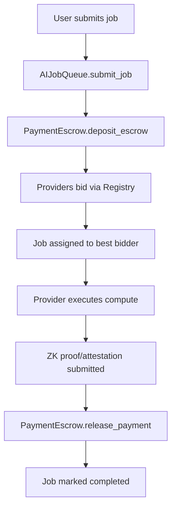
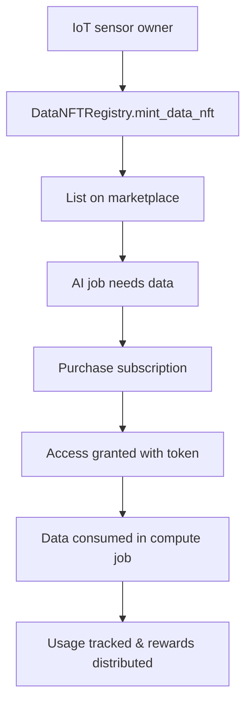

# PolkaMesh Smart Contracts

## 🚀 Overview

PolkaMesh is a decentralized AI compute and data marketplace built on Polkadot that enables:

- **AI Job Submission & Execution**: Decentralized compute for ML inference and training
- **Data Marketplace**: IoT/DePIN data monetization through Data NFTs
- **Cross-Chain Payments**: XCM-enabled escrow and settlement
- **Privacy-First Compute**: ZK attestation and confidential compute integration
- **Reputation System**: Provider scoring and anti-Sybil mechanisms

## 📁 Contract Architecture

Our modular approach consists of four main contracts:

```
PolkaMesh-Contracts/
├── ai_job_queue/           # Core job submission and lifecycle
├── payment_escrow/         # Cross-chain escrow and settlement
├── compute_provider_registry/  # Provider registration and bidding
├── data_nft_registry/      # IoT data tokenization and access
└── README.md              # This file
```

## 🏗️ Contract Details

### 1. **AI Job Queue** (`ai_job_queue/`)

**Purpose**: Core job submission, queue management, and lifecycle tracking

**Key Features**:

- Job registration with detailed specs (model, data, compute requirements)
- Status tracking: `Registered → Assigned → InProgress → Completed/Disputed`
- Deadline enforcement and privacy flags
- Event emission for off-chain monitoring

**Main Functions**:

```rust
submit_job(model_ref, data_ref, compute_type, deadline, privacy) -> job_id
get_job(job_id) -> Job
assign_provider(job_id, provider) -> bool
mark_completed(job_id) -> bool
```

**Use Cases**:

- DApp submits ML inference job with payment
- City requests traffic prediction using IoT data
- DEX submits anti-MEV analysis job

---

### 2. **Payment Escrow** (`payment_escrow/`)

**Purpose**: Secure payment handling, cross-chain settlement via XCM

**Key Features**:

- Escrow deposits when jobs are submitted
- Payment release on job completion (with attestation)
- Refund mechanism for disputes/failures
- Multi-token support (DOT, parachain tokens, stablecoins)

**Main Functions**:

```rust
deposit_escrow(job_id, amount) -> bool
release_payment(job_id, provider) -> bool
refund_payment(job_id, reason) -> bool
get_escrow_balance(job_id) -> Balance
```

**Security Features**:

- Only authorized verifiers can release payments
- Dispute resolution with governance hooks
- Automatic refunds for missed deadlines

---

### 3. **Compute Provider Registry** (`compute_provider_registry/`)

**Purpose**: Provider onboarding, capability management, and bidding system

**Key Features**:

- Provider registration with capabilities (GPU, CPU, Phala TEE, etc.)
- Reputation tracking and scoring
- Bidding system with SLA commitments
- Stake-based Sybil resistance

**Main Functions**:

```rust
register_provider(capabilities, stake) -> bool
submit_bid(job_id, price, sla_commitment) -> bool
update_reputation(provider, score_delta) -> bool
get_provider_info(provider) -> ProviderInfo
```

**Provider Types**:

- **Phala Network**: Confidential compute via TEE/SGX
- **Acurast**: Decentralized cloud compute
- **Community Nodes**: General purpose compute providers

---

### 4. **Data NFT Registry** (`data_nft_registry/`)

**Purpose**: IoT data tokenization, access control, and monetization

**Key Features**:

- Data stream tokenization as NFTs
- Subscription-based access control
- Usage tracking and payment distribution
- Privacy-preserving metadata storage

**Main Functions**:

```rust
mint_data_nft(metadata, access_policy) -> nft_id
purchase_subscription(nft_id, duration) -> bool
access_data(nft_id, proof_of_payment) -> access_token
get_data_usage_stats(nft_id) -> UsageStats
```

**Data Types**:

- **Smart City**: Traffic, energy, weather, pollution sensors
- **IoT Networks**: Industrial sensors, consumer devices
- **Financial Data**: DeFi metrics, cross-chain analytics

## 🔄 System Interactions

### Complete Job Flow



### Data Marketplace Flow



## 🛠️ Development Setup

### Prerequisites

```bash
# Install Rust and cargo-contract
curl --proto "=https" --tlsv1.2 -sSf https://sh.rustup.rs | sh
rustup update stable
rustup target add wasm32-unknown-unknown
cargo install --force --locked --tag v6.0.0-alpha.4 --git https://github.com/use-ink/cargo-contract

# Install ink-node for local testing
# Download from: https://github.com/use-ink/ink-node/releases
wget https://github.com/use-ink/ink-node/releases/download/v0.45.1/ink-node-linux.tar.gz
tar -xzf ink-node-linux.tar.gz
chmod +x ./ink-node
sudo mv ./ink-node /usr/local/bin/
```

### Build All Contracts

```bash
# From PolkaMesh-Contracts directory
cd ai_job_queue && cargo contract build && cd ..
cd payment_escrow && cargo contract build && cd ..
cd compute_provider_registry && cargo contract build && cd ..
cd data_nft_registry && cargo contract build && cd ..
```

### Run Tests

```bash
# Test individual contracts
cd ai_job_queue && cargo test && cd ..
cd payment_escrow && cargo test && cd ..
cd compute_provider_registry && cargo test && cd ..
cd data_nft_registry && cargo test && cd ..
```

### Local Development Node

```bash
# Start ink-node for local testing
ink-node --dev --tmp

# Access via Polkadot.js Apps
# https://polkadot.js.org/apps/?rpc=ws://127.0.0.1:9944
```

## 🔐 Security Considerations

### Access Control

- **Job Ownership**: Only job owners can cancel or dispute
- **Provider Authorization**: Only registered providers can bid
- **Payment Release**: Requires ZK proof or authorized attestation
- **Data Access**: Subscription-based with usage limits

### Economic Security

- **Provider Staking**: Required stake to prevent Sybil attacks
- **Reputation System**: Score-based provider ranking
- **Slashing**: Penalties for SLA violations or malicious behavior
- **Dispute Resolution**: Governance-based arbitration

### Privacy & Confidentiality

- **Data Hashing**: Only IPFS hashes stored on-chain
- **ZK Attestation**: Proof of compute without revealing data
- **TEE Integration**: Phala Network for confidential execution
- **Access Tokens**: Time-limited data access credentials

## 🎯 Use Case Examples

### 1. Smart City Traffic Optimization

```
City → mint_data_nft(traffic_sensors)
Developer → submit_job(traffic_prediction_model, city_data_nft)
Phala Provider → execute_confidential_compute()
City → receives payment, Developer gets predictions
```

### 2. DeFi Anti-MEV Protection

```
DEX → submit_job(mev_detection_model, cross_chain_data)
Compute Provider → analyze_transaction_patterns()
DEX → receives MEV risk scores for routing decisions
```

### 3. Federated ML Training

```
Multiple Providers → register_with_training_capabilities()
Researcher → submit_job(federated_model, distributed_datasets)
Providers → contribute_local_training(zk_proofs)
Researcher → receives_aggregated_model()
```

## 🚀 Deployment Guide

### Local Deployment

1. Start ink-node: `ink-node --dev --tmp`
2. Build contracts: `cargo contract build` (in each directory)
3. Deploy via Polkadot.js Apps or use deployment scripts
4. Initialize with default parameters

### Testnet Deployment

You have two easy options we’ve validated with ink! v6:

#### A) Paseo Pop (ink! v6 / Revive)

- RPC: `wss://rpc1.paseo.popnetwork.xyz`
- Types: `Address = H160`, `Balance = U256`
- Commands per contract:

```bash
# from each contract folder
cargo contract build --release
cargo contract upload --suri //Alice --url wss://rpc1.paseo.popnetwork.xyz -x

# instantiate
# payment_escrow
cargo contract instantiate --constructor new --suri //Alice --url wss://rpc1.paseo.popnetwork.xyz --execute --skip-confirm

# ai_job_queue (example: min budget = 1000)
cargo contract instantiate --constructor new --args 1000 --suri //Alice --url wss://rpc1.paseo.popnetwork.xyz --execute --skip-confirm

# compute_provider_registry (example: min stake = 500)
cargo contract instantiate --constructor new --args 500 --suri //Alice --url wss://rpc1.paseo.popnetwork.xyz --execute --skip-confirm

# data_nft_registry
cargo contract instantiate --constructor new --suri //Alice --url wss://rpc1.paseo.popnetwork.xyz --execute --skip-confirm
```

Record the resulting contract addresses and code hashes (printed by the CLI) into `deployments/paseo.template.json` and save a copy as `deployments/paseo.json`.

Notes:

- On Revive chains you may see warnings about type comparison; this is expected.
- If a mapping pallet is enabled on a given runtime, map the account once via the UI before calls.

#### B) Passet Hub Testnet (ink! v6)

- RPC: `wss://testnet-passet-hub.polkadot.io`
- Prereqs: funded test account (PAS faucet), cargo-contract 6.x

```bash
# build
cargo contract build --release

# upload
cargo contract upload --suri "<seed_or_//Alice>" --url wss://testnet-passet-hub.polkadot.io -x

# instantiate per contract (adjust constructor args as needed)
cargo contract instantiate --constructor new --suri "<seed_or_//Alice>" --url wss://testnet-passet-hub.polkadot.io --execute --skip-confirm
```

Copy addresses into `deployments/passet-hub.template.json` and save as `deployments/passet-hub.json`.

### Mainnet Considerations

- **Audit**: Security audit before mainnet deployment
- **Governance**: Multi-sig or governance-controlled upgrades
- **Monitoring**: Event monitoring and alerting
- **Documentation**: User guides and SDK integration

## 📚 Integration Guide

### For Frontend Developers

```typescript
// Example SDK usage (TypeScript)
import { PolkaMeshSDK } from "@polkamesh/sdk";

const sdk = new PolkaMeshSDK(wsProvider);

// Submit AI job
const jobId = await sdk.submitJob({
  modelRef: "QmHash...",
  dataRef: "QmDataHash...",
  computeType: "phala-confidential",
  budget: "1000000000000", // 1 DOT
  deadline: Date.now() + 3600000, // 1 hour
});

// Monitor job status
sdk.onJobStatusChange(jobId, (status) => {
  console.log("Job status:", status);
});
```

### For Data Providers

```typescript
// Mint data NFT for IoT sensor
const nftId = await sdk.mintDataNFT({
  sensorType: "traffic_camera",
  location: { lat: 40.7128, lng: -74.006 },
  accessPolicy: "subscription",
  pricePerHour: "100000000", // 0.1 DOT
});
```

### For Compute Providers

```typescript
// Register as compute provider
await sdk.registerProvider({
  capabilities: ["gpu", "phala-tee"],
  stake: "10000000000000", // 10 DOT
  regions: ["us-east", "eu-west"],
});

// Listen for job opportunities
sdk.onJobAvailable((job) => {
  if (canExecute(job)) {
    sdk.submitBid(job.id, price, slaCommitment);
  }
});
```

## 🤝 Contributing

1. **Fork** the repository
2. **Create** feature branch: `git checkout -b feature/new-contract`
3. **Write** tests for new functionality
4. **Build** and test: `cargo contract build && cargo test`
5. **Submit** pull request with detailed description

## 📄 License

MIT License - see LICENSE file for details

## 🔗 Resources

- [ink! Documentation](https://use.ink/)
- [Polkadot.js Apps](https://polkadot.js.org/apps/)
- [Substrate Contracts Node](https://github.com/paritytech/substrate-contracts-node)
- [Phala Network](https://phala.network/)
- [XCM Documentation](https://wiki.polkadot.network/docs/learn-xcm)

## 📞 Support

- **Discord**: [PolkaMesh Community](https://discord.gg/polkamesh)
- **GitHub Issues**: Report bugs and feature requests
- **Documentation**: [docs.polkamesh.io](https://docs.polkamesh.io)
- **Email**: dev@polkamesh.io

---

**Built with ❤️ for the Polkadot ecosystem**
