# 📋 AI Job Queue Contract

Smart contract for managing AI compute job submissions and lifecycle tracking in the PolkadotAiMesh network.

**Status:** ✅ Builds and compiles  
**Environment:** EVM-like primitives (H160 addresses, U256 balances)

---

## 🏗️ Constructor

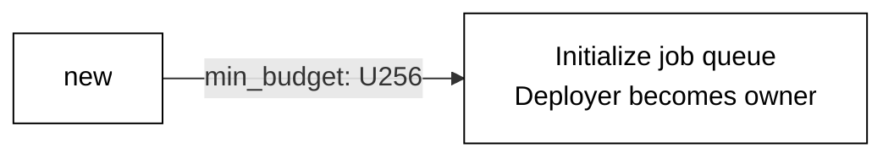

---

## 📝 Contract Functions

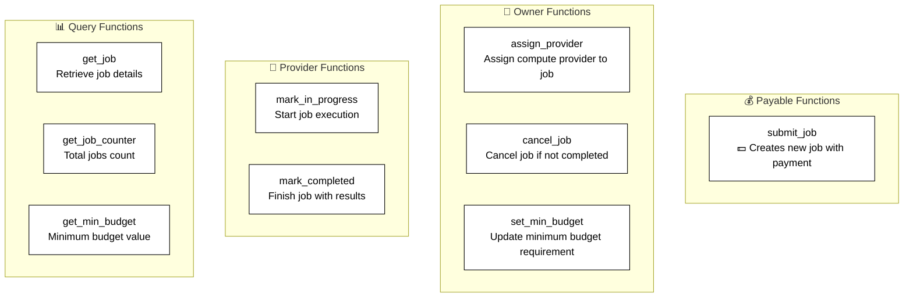

---

## 🔄 Job Lifecycle Flow

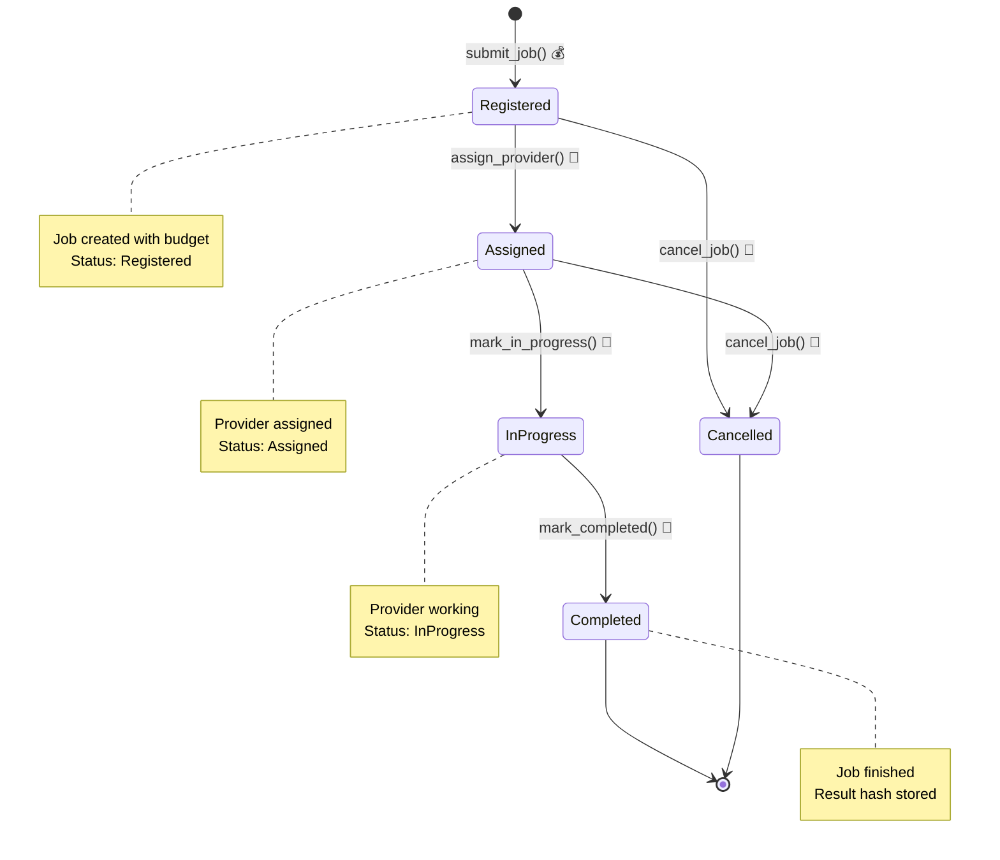

---

## 📋 Function Details

### 💰 submit_job (Payable)

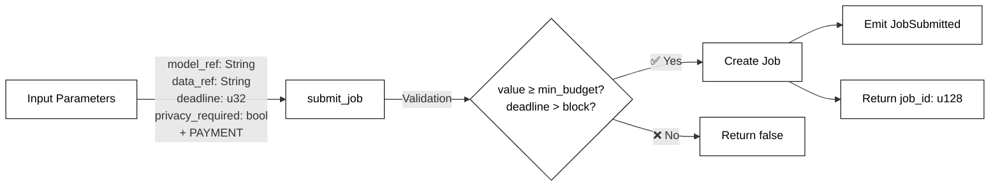

**Requirements:**

- `transferred_value >= min_budget`
- `deadline > current_block`

---

### 👤 assign_provider (Owner Only)

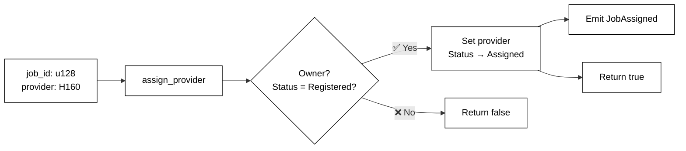

---

### 🔧 mark_in_progress (Provider Only)

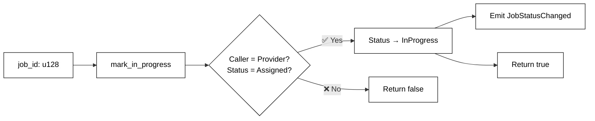

---

### 🔧 mark_completed (Provider Only)

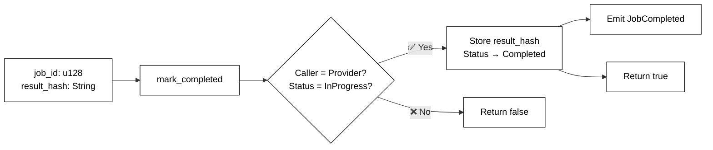

---

### 👤 cancel_job (Owner Only)

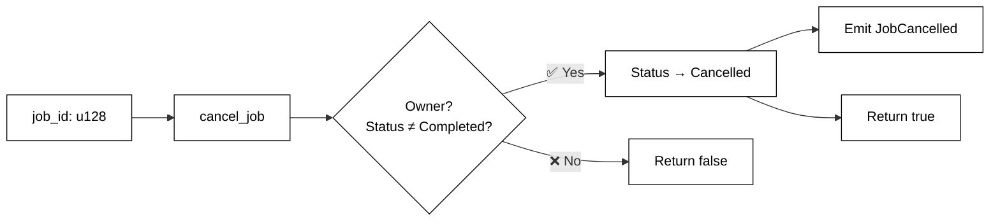

---

## 📊 Query Functions

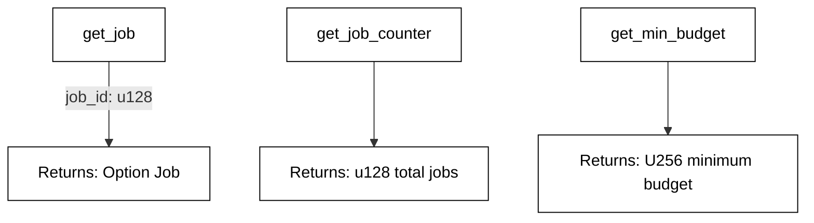

---

## 📤 Events

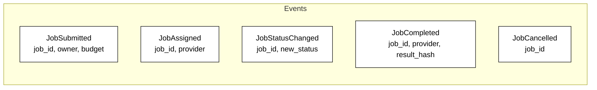

---

## 🏗️ Data Types

### Job Structure

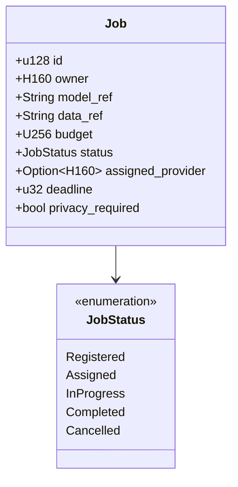

---

## ⚙️ Access Control

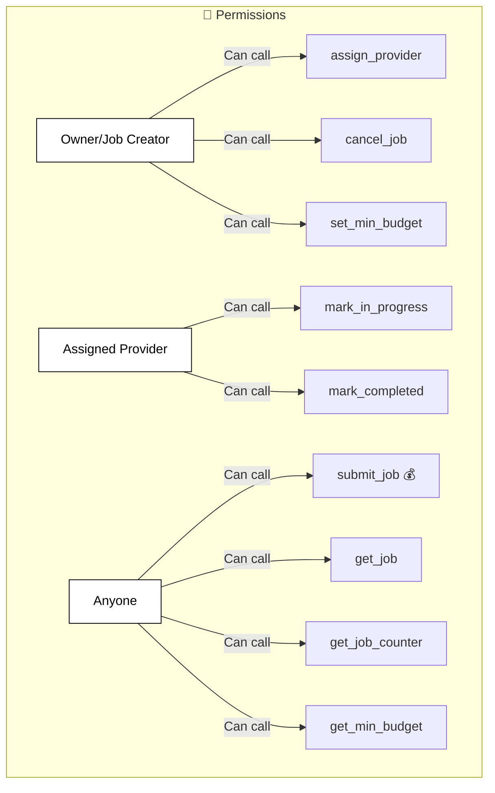

---

## 🔒 Constraints & Rules

✅ **Submission Requirements:**

- Payment must be ≥ `min_budget`
- Deadline must be in the future

✅ **State Transitions:**

- Jobs must follow: Registered → Assigned → InProgress → Completed
- Cancellation only allowed before Completed state

✅ **Provider Actions:**

- Only assigned provider can mark progress/completion
- Provider cannot be changed after assignment

✅ **Owner Actions:**

- Owner can cancel job anytime before completion
- Only owner can assign initial provider
