# 🖥️ Compute Provider Registry

Smart contract for managing compute provider registration and profiles in the PolkadotAiMesh network.

**Status:** ✅ Builds and compiles  
**Environment:** EVM-like primitives (H160 addresses, U256 balances)

## 🧪 Tests

- Unit tests: 22 passing (contract test suite validated locally)

How to run the tests locally:

```bash
# from the repository root
cd PolkaMesh-Contracts/compute_provider_registry
cargo test
```

---

## 🏗️ Constructor

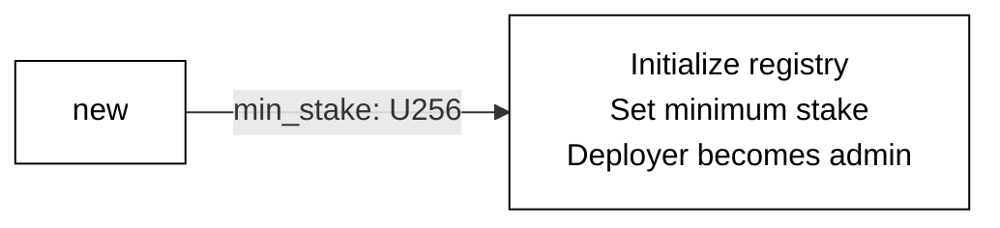

---

## 📝 Contract Functions

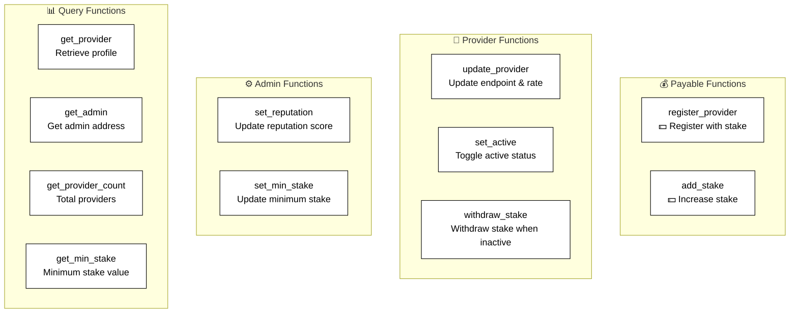

---

## 🔄 Provider Lifecycle

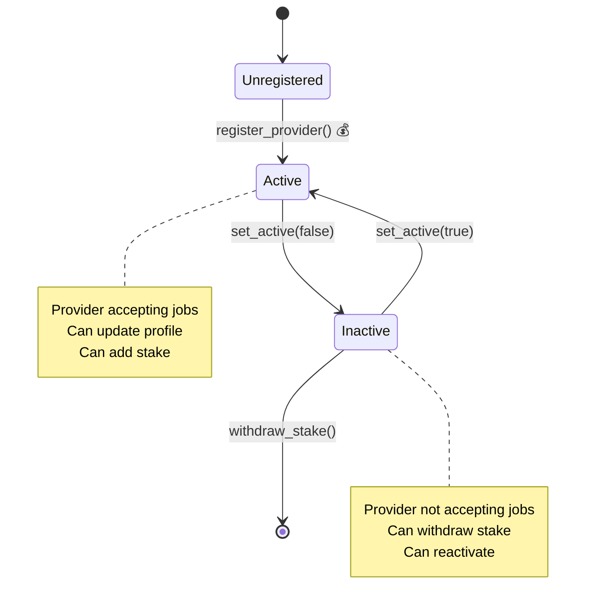

---

## 📋 Function Details

### 💰 register_provider (Payable)

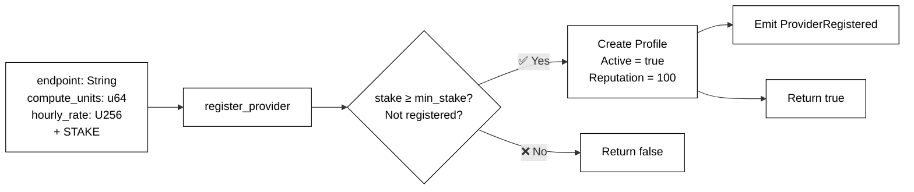

**Requirements:**

- `transferred_value >= min_stake`
- Provider address not already registered

---

### 👤 update_provider (Provider Only)

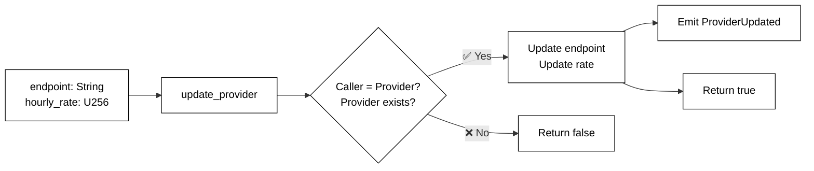

---

### 🔄 set_active (Provider Only)

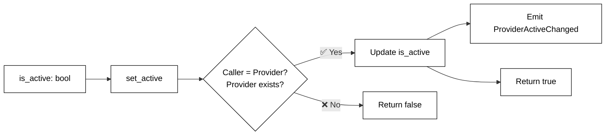

---

### 💰 add_stake (Provider Only, Payable)

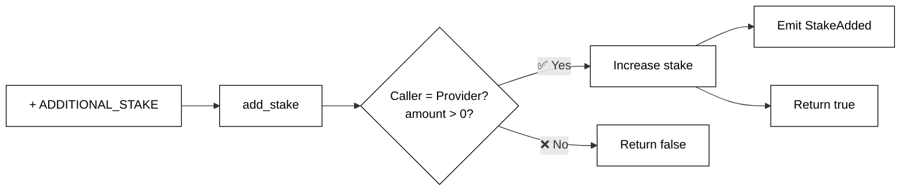

---

### 💸 withdraw_stake (Provider/Admin Only)

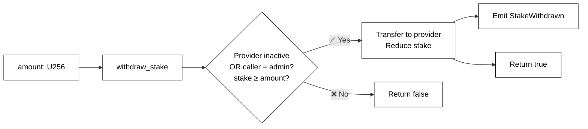

**Requirements:**

- Provider must be inactive OR caller is admin
- Sufficient stake available

---

### ⚙️ set_reputation (Admin Only)

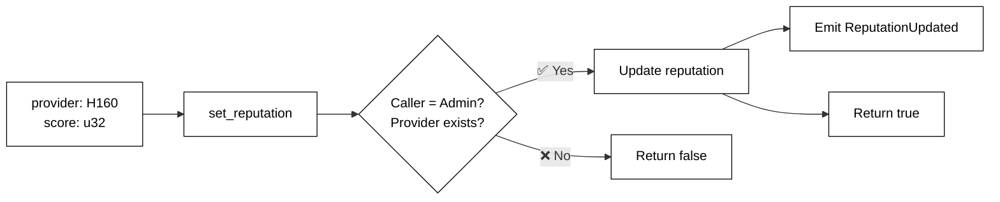

---

### ⚙️ set_min_stake (Admin Only)

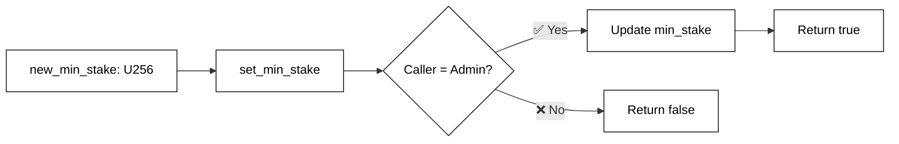

---

## 📊 Query Functions

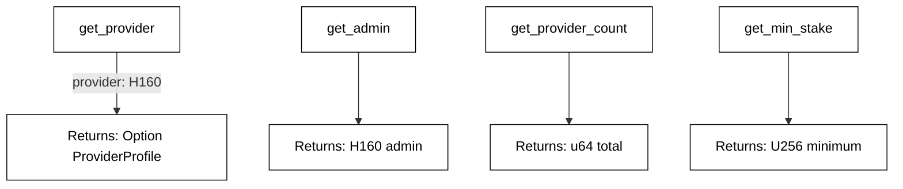

---

## 📤 Events

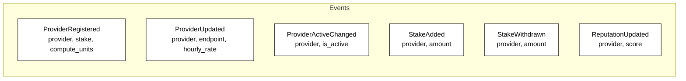

---

## 🏗️ Data Types

### ProviderProfile Structure

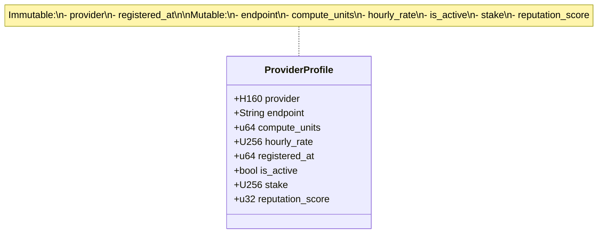

---

## ⚙️ Access Control

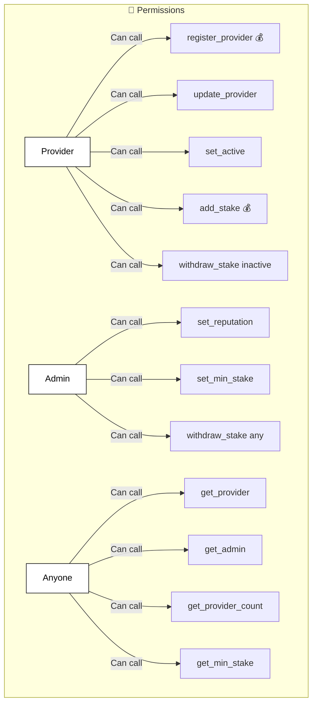

---

## 🎯 Registration Flow

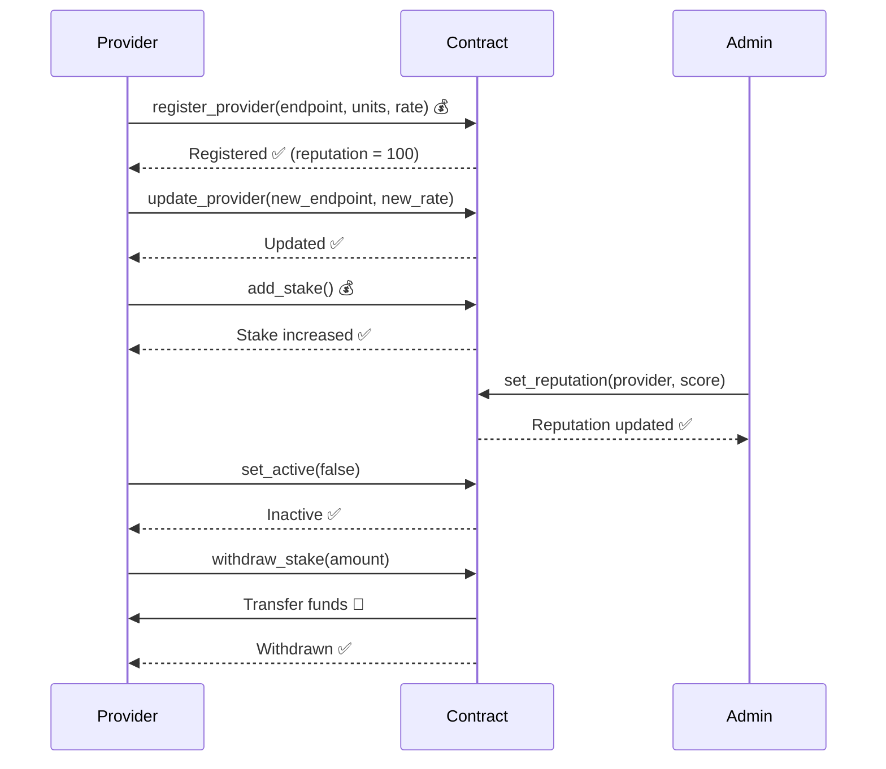

---

## 🔒 Constraints & Rules

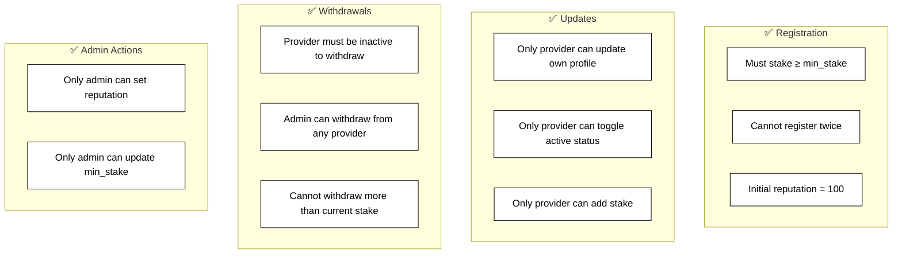

---

## 📊 Reputation System

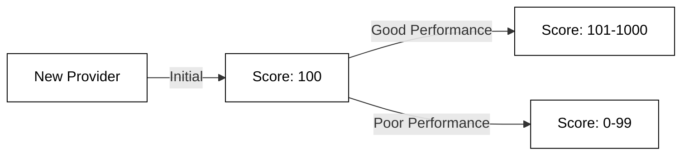

**Reputation Range:** 0 - 1000 (u32)

- **100**: Default for new providers
- **0-99**: Below average
- **100-199**: Average
- **200+**: Above average
