# 🖥️ Compute Provider Registry

Smart contract for managing compute provider registration and profiles in the PolkadotAiMesh network.

**Status:** ✅ Builds and compiles  
**Environment:** EVM-like primitives (H160 addresses, U256 balances)

---

## 🏗️ Constructor

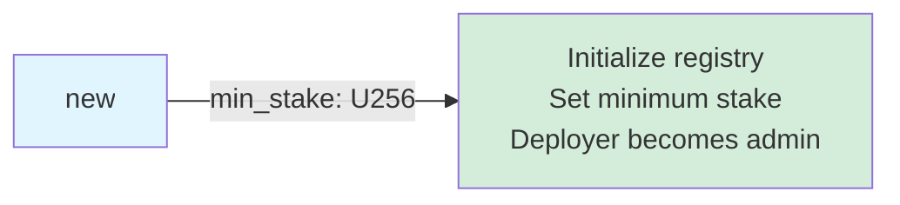

---

## 📝 Contract Functions

```mermaid
graph TB
    subgraph "💰 Payable Functions"
        A1[register_provider<br/>💵 Register with stake]
        A2[add_stake<br/>💵 Increase stake]
    end

    subgraph "👤 Provider Functions"
        B1[update_provider<br/>Update endpoint & rate]
        B2[set_active<br/>Toggle active status]
        B3[withdraw_stake<br/>Withdraw stake when inactive]
    end

    subgraph "⚙️ Admin Functions"
        C1[set_reputation<br/>Update reputation score]
        C2[set_min_stake<br/>Update minimum stake]
    end

    subgraph "📊 Query Functions"
        D1[get_provider<br/>Retrieve profile]
        D2[get_admin<br/>Get admin address]
        D3[get_provider_count<br/>Total providers]
        D4[get_min_stake<br/>Minimum stake value]
    end

    style A1 fill:#fff3cd
    style A2 fill:#fff3cd
    style B1 fill:#d4edda
    style B2 fill:#d4edda
    style B3 fill:#d4edda
    style C1 fill:#f8d7da
    style C2 fill:#f8d7da
    style D1 fill:#e2e3e5
    style D2 fill:#e2e3e5
    style D3 fill:#e2e3e5
    style D4 fill:#e2e3e5
```

---

## 🔄 Provider Lifecycle

---

## 📋 Function Details

### 💰 register_provider (Payable)

```mermaid
graph LR
    A[endpoint: String<br/>compute_units: u64<br/>hourly_rate: U256<br/>+ STAKE] --> B[register_provider]
    B --> C{stake ≥ min_stake?<br/>Not registered?}
    C -->|✅ Yes| D[Create Profile<br/>Active = true<br/>Reputation = 100]
    C -->|❌ No| E[Return false]
    D --> F[Emit ProviderRegistered]
    D --> G[Return true]

    style A fill:#e1f5ff
    style B fill:#fff3cd
    style C fill:#ffeaa7
    style D fill:#d4edda
    style E fill:#f8d7da
    style F fill:#dfe6e9
    style G fill:#d4edda
```

**Requirements:**

- `transferred_value >= min_stake`
- Provider address not already registered

---

### 👤 update_provider (Provider Only)

```mermaid
graph LR
    A[endpoint: String<br/>hourly_rate: U256] --> B[update_provider]
    B --> C{Caller = Provider?<br/>Provider exists?}
    C -->|✅ Yes| D[Update endpoint<br/>Update rate]
    C -->|❌ No| E[Return false]
    D --> F[Emit ProviderUpdated]
    D --> G[Return true]

    style A fill:#e1f5ff
    style B fill:#d4edda
    style C fill:#ffeaa7
    style D fill:#d4edda
    style E fill:#f8d7da
    style F fill:#dfe6e9
    style G fill:#d4edda
```

---

### 🔄 set_active (Provider Only)

```mermaid
graph LR
    A[is_active: bool] --> B[set_active]
    B --> C{Caller = Provider?<br/>Provider exists?}
    C -->|✅ Yes| D[Update is_active]
    C -->|❌ No| E[Return false]
    D --> F[Emit ProviderActiveChanged]
    D --> G[Return true]

    style A fill:#e1f5ff
    style B fill:#d4edda
    style C fill:#ffeaa7
    style D fill:#d4edda
    style E fill:#f8d7da
    style F fill:#dfe6e9
    style G fill:#d4edda
```

---

### 💰 add_stake (Provider Only, Payable)

```mermaid
graph LR
    A[+ ADDITIONAL_STAKE] --> B[add_stake]
    B --> C{Caller = Provider?<br/>amount > 0?}
    C -->|✅ Yes| D[Increase stake]
    C -->|❌ No| E[Return false]
    D --> F[Emit StakeAdded]
    D --> G[Return true]

    style A fill:#e1f5ff
    style B fill:#fff3cd
    style C fill:#ffeaa7
    style D fill:#d4edda
    style E fill:#f8d7da
    style F fill:#dfe6e9
    style G fill:#d4edda
```

---

### 💸 withdraw_stake (Provider/Admin Only)

```mermaid
graph LR
    A[amount: U256] --> B[withdraw_stake]
    B --> C{Provider inactive<br/>OR caller = admin?<br/>stake ≥ amount?}
    C -->|✅ Yes| D[Transfer to provider<br/>Reduce stake]
    C -->|❌ No| E[Return false]
    D --> F[Emit StakeWithdrawn]
    D --> G[Return true]

    style A fill:#e1f5ff
    style B fill:#d4edda
    style C fill:#ffeaa7
    style D fill:#d4edda
    style E fill:#f8d7da
    style F fill:#dfe6e9
    style G fill:#d4edda
```

**Requirements:**

- Provider must be inactive OR caller is admin
- Sufficient stake available

---

### ⚙️ set_reputation (Admin Only)

```mermaid
graph LR
    A[provider: H160<br/>score: u32] --> B[set_reputation]
    B --> C{Caller = Admin?<br/>Provider exists?}
    C -->|✅ Yes| D[Update reputation]
    C -->|❌ No| E[Return false]
    D --> F[Emit ReputationUpdated]
    D --> G[Return true]

    style A fill:#e1f5ff
    style B fill:#f8d7da
    style C fill:#ffeaa7
    style D fill:#d4edda
    style E fill:#f8d7da
    style F fill:#dfe6e9
    style G fill:#d4edda
```

---

### ⚙️ set_min_stake (Admin Only)

```mermaid
graph LR
    A[new_min_stake: U256] --> B[set_min_stake]
    B --> C{Caller = Admin?}
    C -->|✅ Yes| D[Update min_stake]
    C -->|❌ No| E[Return false]
    D --> F[Return true]

    style A fill:#e1f5ff
    style B fill:#f8d7da
    style C fill:#ffeaa7
    style D fill:#d4edda
    style E fill:#f8d7da
    style F fill:#d4edda
```

---

## 📊 Query Functions

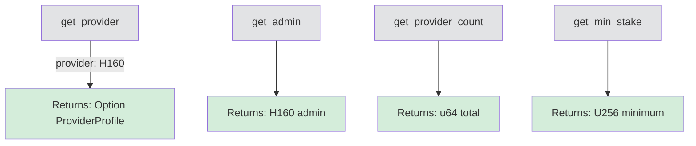

---

## 📤 Events

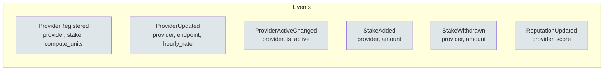

---

## 🏗️ Data Types

### ProviderProfile Structure

---

## ⚙️ Access Control

```mermaid
graph TB
    subgraph "🔐 Permissions"
        A[Provider] -->|Can call| A1[register_provider 💰]
        A -->|Can call| A2[update_provider]
        A -->|Can call| A3[set_active]
        A -->|Can call| A4[add_stake 💰]
        A -->|Can call| A5[withdraw_stake inactive]

        B[Admin] -->|Can call| B1[set_reputation]
        B -->|Can call| B2[set_min_stake]
        B -->|Can call| B3[withdraw_stake any]

        C[Anyone] -->|Can call| C1[get_provider]
        C -->|Can call| C2[get_admin]
        C -->|Can call| C3[get_provider_count]
        C -->|Can call| C4[get_min_stake]
    end

    style A fill:#d4edda
    style B fill:#f8d7da
    style C fill:#e2e3e5
```

---

## 🎯 Registration Flow

```mermaid
sequenceDiagram
    participant Provider
    participant Contract
    participant Admin

    Provider->>Contract: register_provider(endpoint, units, rate) 💰
    Contract-->>Provider: Registered ✅ (reputation = 100)

    Provider->>Contract: update_provider(new_endpoint, new_rate)
    Contract-->>Provider: Updated ✅

    Provider->>Contract: add_stake() 💰
    Contract-->>Provider: Stake increased ✅

    Admin->>Contract: set_reputation(provider, score)
    Contract-->>Admin: Reputation updated ✅

    Provider->>Contract: set_active(false)
    Contract-->>Provider: Inactive ✅

    Provider->>Contract: withdraw_stake(amount)
    Contract->>Provider: Transfer funds 💸
    Contract-->>Provider: Withdrawn ✅
```

---

## 🔒 Constraints & Rules

```mermaid
graph TB
    subgraph "✅ Registration"
        A1[Must stake ≥ min_stake]
        A2[Cannot register twice]
        A3[Initial reputation = 100]
    end

    subgraph "✅ Updates"
        B1[Only provider can update own profile]
        B2[Only provider can toggle active status]
        B3[Only provider can add stake]
    end

    subgraph "✅ Withdrawals"
        C1[Provider must be inactive to withdraw]
        C2[Admin can withdraw from any provider]
        C3[Cannot withdraw more than current stake]
    end

    subgraph "✅ Admin Actions"
        D1[Only admin can set reputation]
        D2[Only admin can update min_stake]
    end

    style A1 fill:#d4edda
    style A2 fill:#d4edda
    style A3 fill:#d4edda
    style B1 fill:#d1ecf1
    style B2 fill:#d1ecf1
    style B3 fill:#d1ecf1
    style C1 fill:#fff3cd
    style C2 fill:#fff3cd
    style C3 fill:#fff3cd
    style D1 fill:#f8d7da
    style D2 fill:#f8d7da
```

---

## 📊 Reputation System

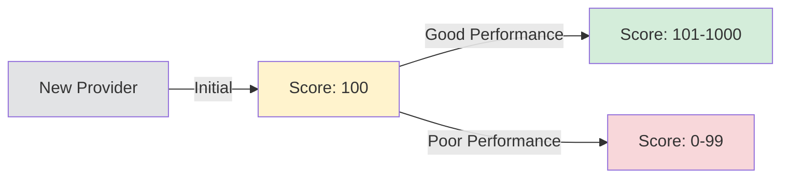

**Reputation Range:** 0 - 1000 (u32)

- **100**: Default for new providers
- **0-99**: Below average
- **100-199**: Average
- **200+**: Above average
