# 🎨 Data NFT Registry

Smart contract for minting and managing data NFTs with access control and privacy settings in the PolkadotAiMesh network.

**Status:** ✅ Builds and compiles  
**Environment:** EVM-like primitives (H160 addresses, U256 balances)

---

## 🏗️ Constructor

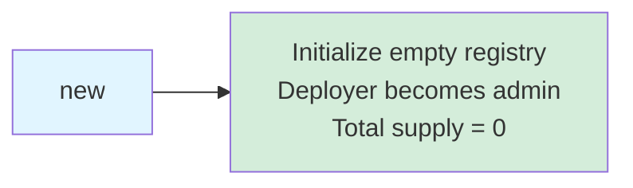

---

## 📝 Contract Functions

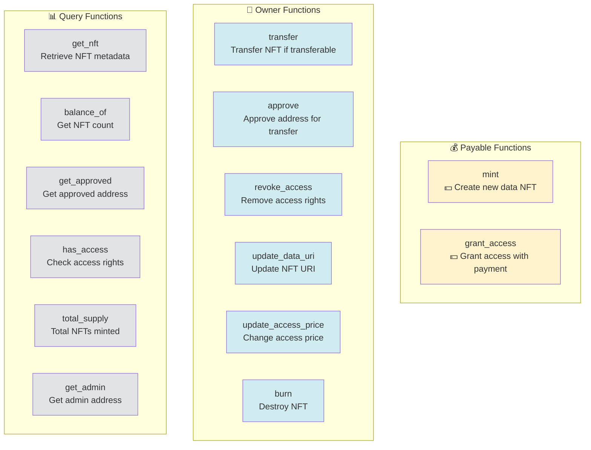

---

## 🔄 NFT Lifecycle

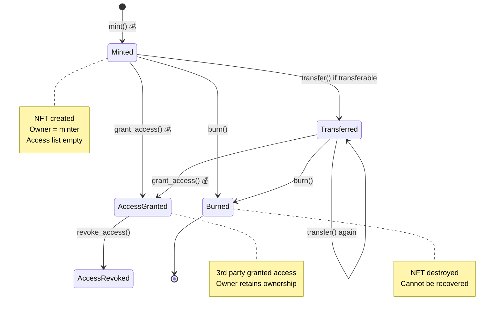

---

## 📋 Function Details

### 💰 mint (Payable)

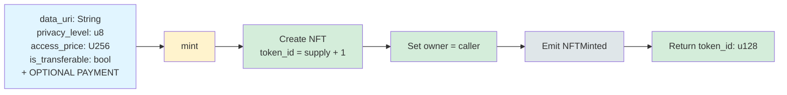

**Note:** Minting is always successful. Payment is optional (for future extensions).

---

### 👤 transfer (Owner Only)

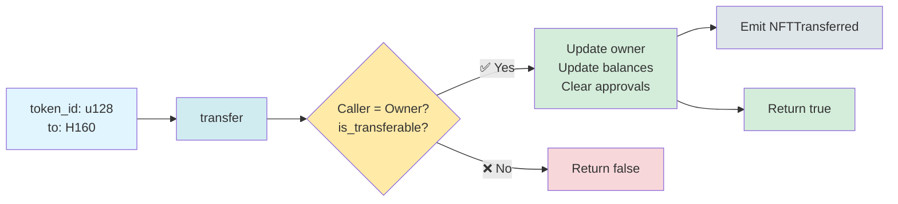

**Requirements:**
- Caller must be owner
- `is_transferable == true`

---

### 👤 approve (Owner Only)

---

### 💰 grant_access (Owner Only, Payable)

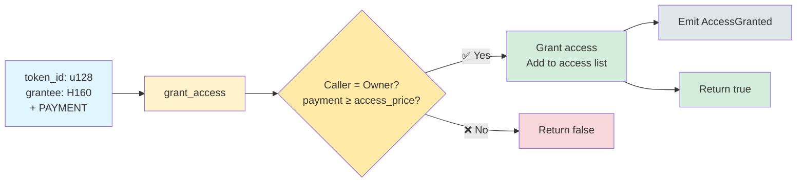

**Requirements:**
- Caller must be owner
- `transferred_value >= access_price`

---

### 👤 revoke_access (Owner/Admin Only)

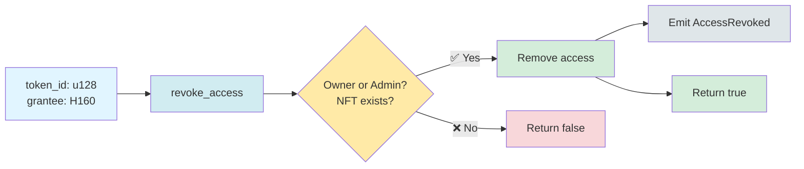

---

### 👤 update_data_uri (Owner Only)

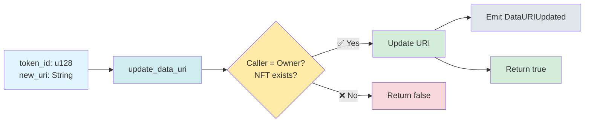

---

### 👤 update_access_price (Owner Only)

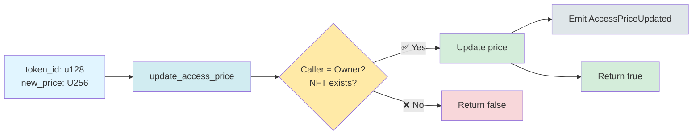

---

### 👤 burn (Owner/Admin Only)

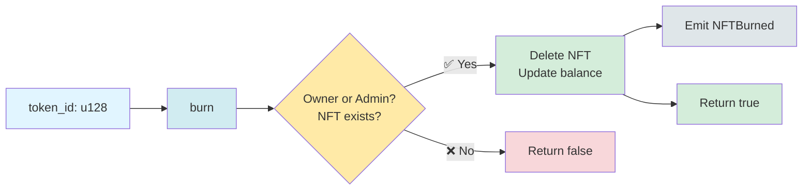

---

## 📊 Query Functions

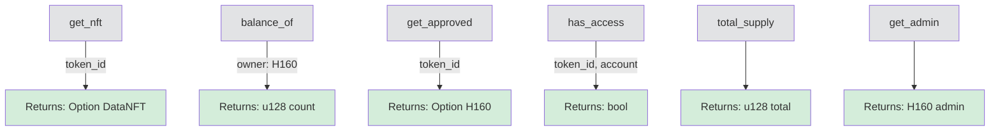

---

## 📤 Events

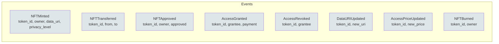

---

## 🏗️ Data Types

### DataNFT Structure

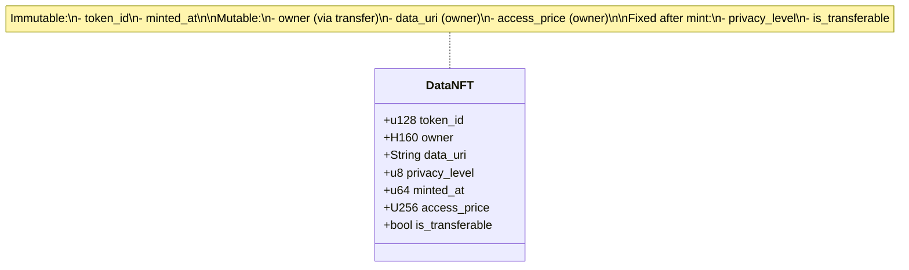

---

## ⚙️ Access Control

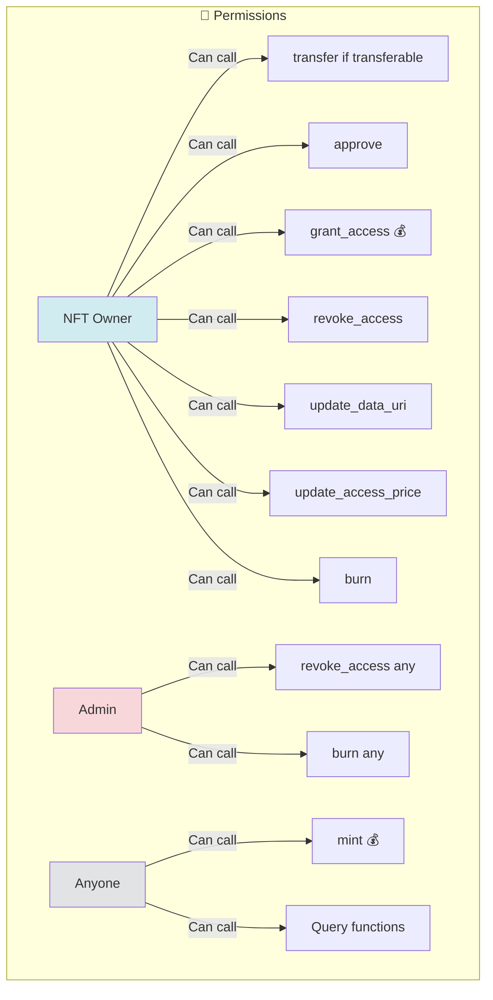

---

## 🎯 Minting & Access Flow

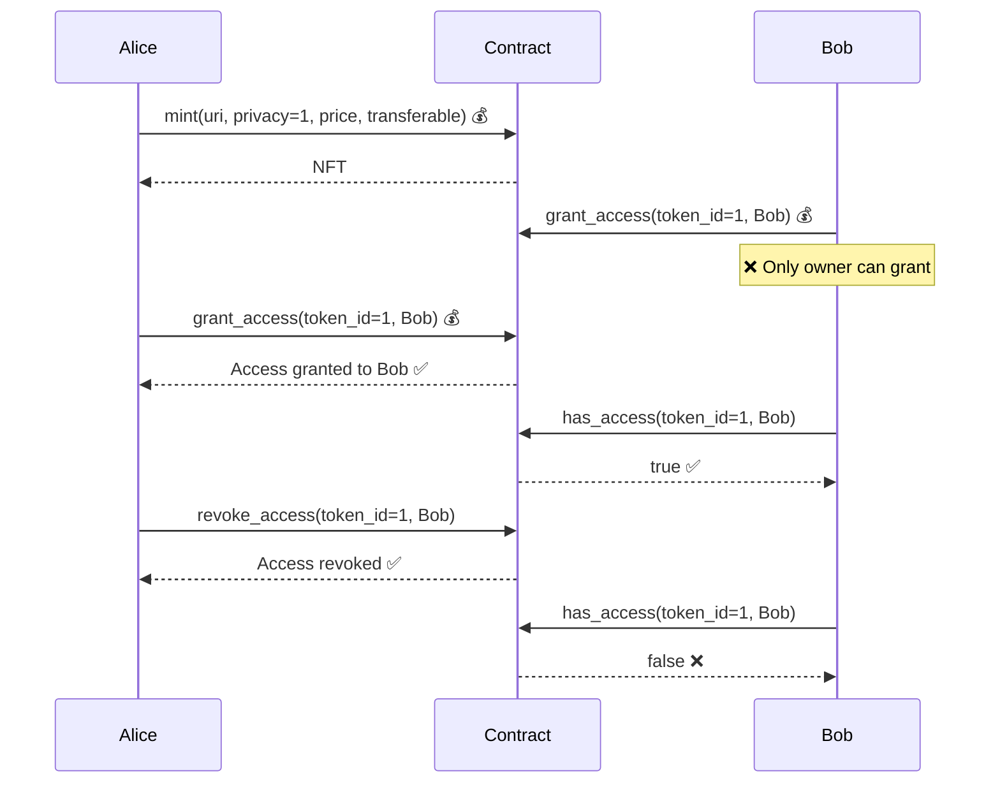

---

## 🔐 Privacy Levels

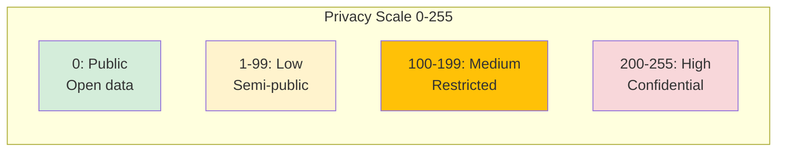

**Privacy Level Usage:**
- **0**: Public data, no restrictions
- **1-99**: Low privacy, minimal protection
- **100-199**: Medium privacy, restricted access
- **200-255**: High privacy, highly confidential

*Note: Privacy enforcement happens off-chain via access verification*

---

## 🔒 Constraints & Rules

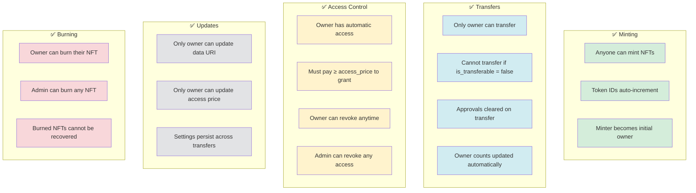

---

## 🛡️ Safety Features

✅ **Owner Rights:**
- Full control over their NFTs
- Can update metadata and pricing
- Can grant/revoke access

✅ **Access Management:**
- Payment required for access grants
- Owner always has implicit access
- Granular per-NFT access control

✅ **Transfer Control:**
- NFTs can be made non-transferable
- Useful for soulbound data tokens
- Protects against unwanted transfers

✅ **Admin Oversight:**
- Admin can moderate content (burn)
- Admin can revoke malicious access
- Emergency intervention capability
