# 🎨 Data NFT Registry

Smart contract for minting and managing data NFTs with access control and privacy settings in the PolkadotAiMesh network.

**Status:** ✅ Builds and compiles  
**Environment:** EVM-like primitives (H160 addresses, U256 balances)

## 🧪 Tests

- Unit tests: 28 passing (contract test suite validated locally)

How to run the tests locally:

```bash
# from the repository root
cd PolkaMesh-Contracts/data_nft_registry
cargo test
```

---

## 🏗️ Constructor

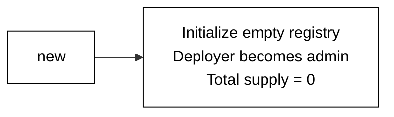

---

## 📝 Contract Functions

```mermaid
graph TB
    subgraph "💰 Payable Functions"
        A1[mint<br/>💵 Create new data NFT]
        A2[grant_access<br/>💵 Grant access with payment]
    end

    subgraph "👤 Owner Functions"
        B1[transfer<br/>Transfer NFT if transferable]
        B2[approve<br/>Approve address for transfer]
        B3[revoke_access<br/>Remove access rights]
        B4[update_data_uri<br/>Update NFT URI]
        B5[update_access_price<br/>Change access price]
        B6[burn<br/>Destroy NFT]
    end

    subgraph "📊 Query Functions"
        C1[get_nft<br/>Retrieve NFT metadata]
        C2[balance_of<br/>Get NFT count]
        C3[get_approved<br/>Get approved address]
        C4[has_access<br/>Check access rights]
        C5[total_supply<br/>Total NFTs minted]
        C6[get_admin<br/>Get admin address]
    end

    style A1 fill:#ffffff,stroke:#000000,color:#000000
    style A2 fill:#ffffff,stroke:#000000,color:#000000
    style B1 fill:#ffffff,stroke:#000000,color:#000000
    style B2 fill:#ffffff,stroke:#000000,color:#000000
    style B3 fill:#ffffff,stroke:#000000,color:#000000
    style B4 fill:#ffffff,stroke:#000000,color:#000000
    style B5 fill:#ffffff,stroke:#000000,color:#000000
    style B6 fill:#ffffff,stroke:#000000,color:#000000
    style C1 fill:#ffffff,stroke:#000000,color:#000000
    style C2 fill:#ffffff,stroke:#000000,color:#000000
    style C3 fill:#ffffff,stroke:#000000,color:#000000
    style C4 fill:#ffffff,stroke:#000000,color:#000000
    style C5 fill:#ffffff,stroke:#000000,color:#000000
    style C6 fill:#ffffff,stroke:#000000,color:#000000
```

---

## 🔄 NFT Lifecycle

```mermaid
stateDiagram-v2
    [*] --> Minted: mint() 💰

    Minted --> Transferred: transfer() if transferable
    Transferred --> Transferred: transfer() again

    Minted --> AccessGranted: grant_access() 💰
    Transferred --> AccessGranted: grant_access() 💰
    AccessGranted --> AccessRevoked: revoke_access()

    Minted --> Burned: burn()
    Transferred --> Burned: burn()

    Burned --> [*]

    note right of Minted
        NFT created
        Owner = minter
        Access list empty
    end note

    note right of AccessGranted
        3rd party granted access
        Owner retains ownership
    end note

    note right of Burned
        NFT destroyed
        Cannot be recovered
    end note
```

---

## 📋 Function Details

### 💰 mint (Payable)

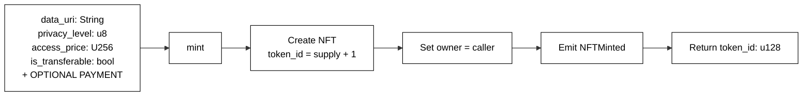

**Note:** Minting is always successful. Payment is optional (for future extensions).

---

### 👤 transfer (Owner Only)

```mermaid
graph LR
    A[token_id: u128<br/>to: H160] --> B[transfer]
    B --> C{Caller = Owner?<br/>is_transferable?}
    C -->|✅ Yes| D[Update owner<br/>Update balances<br/>Clear approvals]
    C -->|❌ No| E[Return false]
    D --> F[Emit NFTTransferred]
    D --> G[Return true]

    style A fill:#ffffff,stroke:#000000,color:#000000
    style B fill:#ffffff,stroke:#000000,color:#000000
    style C fill:#ffffff,stroke:#000000,color:#000000
    style D fill:#ffffff,stroke:#000000,color:#000000
    style E fill:#ffffff,stroke:#000000,color:#000000
    style F fill:#ffffff,stroke:#000000,color:#000000
    style G fill:#ffffff,stroke:#000000,color:#000000
```

**Requirements:**

- Caller must be owner
- `is_transferable == true`

---

### 👤 approve (Owner Only)

```mermaid
graph LR
    A[token_id: u128<br/>approved: H160] --> B[approve]
    B --> C{Caller = Owner?<br/>NFT exists?}
    C -->|✅ Yes| D[Set approval]
    C -->|❌ No| E[Return false]
    D --> F[Emit NFTApproved]
    D --> G[Return true]

    style A fill:#ffffff,stroke:#000000,color:#000000
    style B fill:#ffffff,stroke:#000000,color:#000000
    style C fill:#ffffff,stroke:#000000,color:#000000
    style D fill:#ffffff,stroke:#000000,color:#000000
    style E fill:#ffffff,stroke:#000000,color:#000000
    style F fill:#ffffff,stroke:#000000,color:#000000
    style G fill:#ffffff,stroke:#000000,color:#000000
```

---

### 💰 grant_access (Owner Only, Payable)

```mermaid
graph LR
    A[token_id: u128<br/>grantee: H160<br/>+ PAYMENT] --> B[grant_access]
    B --> C{Caller = Owner?<br/>payment ≥ access_price?}
    C -->|✅ Yes| D[Grant access<br/>Add to access list]
    C -->|❌ No| E[Return false]
    D --> F[Emit AccessGranted]
    D --> G[Return true]

    style A fill:#ffffff,stroke:#000000,color:#000000
    style B fill:#ffffff,stroke:#000000,color:#000000
    style C fill:#ffffff,stroke:#000000,color:#000000
    style D fill:#ffffff,stroke:#000000,color:#000000
    style E fill:#ffffff,stroke:#000000,color:#000000
    style F fill:#ffffff,stroke:#000000,color:#000000
    style G fill:#ffffff,stroke:#000000,color:#000000
```

**Requirements:**

- Caller must be owner
- `transferred_value >= access_price`

---

### 👤 revoke_access (Owner/Admin Only)

```mermaid
graph LR
    A[token_id: u128<br/>grantee: H160] --> B[revoke_access]
    B --> C{Owner or Admin?<br/>NFT exists?}
    C -->|✅ Yes| D[Remove access]
    C -->|❌ No| E[Return false]
    D --> F[Emit AccessRevoked]
    D --> G[Return true]

    style A fill:#ffffff,stroke:#000000,color:#000000
    style B fill:#ffffff,stroke:#000000,color:#000000
    style C fill:#ffffff,stroke:#000000,color:#000000
    style D fill:#ffffff,stroke:#000000,color:#000000
    style E fill:#ffffff,stroke:#000000,color:#000000
    style F fill:#ffffff,stroke:#000000,color:#000000
    style G fill:#ffffff,stroke:#000000,color:#000000
```

---

### 👤 update_data_uri (Owner Only)

```mermaid
graph LR
    A[token_id: u128<br/>new_uri: String] --> B[update_data_uri]
    B --> C{Caller = Owner?<br/>NFT exists?}
    C -->|✅ Yes| D[Update URI]
    C -->|❌ No| E[Return false]
    D --> F[Emit DataURIUpdated]
    D --> G[Return true]

    style A fill:#ffffff,stroke:#000000,color:#000000
    style B fill:#ffffff,stroke:#000000,color:#000000
    style C fill:#ffffff,stroke:#000000,color:#000000
    style D fill:#ffffff,stroke:#000000,color:#000000
    style E fill:#ffffff,stroke:#000000,color:#000000
    style F fill:#ffffff,stroke:#000000,color:#000000
    style G fill:#ffffff,stroke:#000000,color:#000000
```

---

### 👤 update_access_price (Owner Only)

```mermaid
graph LR
    A[token_id: u128<br/>new_price: U256] --> B[update_access_price]
    B --> C{Caller = Owner?<br/>NFT exists?}
    C -->|✅ Yes| D[Update price]
    C -->|❌ No| E[Return false]
    D --> F[Emit AccessPriceUpdated]
    D --> G[Return true]

    style A fill:#ffffff,stroke:#000000,color:#000000
    style B fill:#ffffff,stroke:#000000,color:#000000
    style C fill:#ffffff,stroke:#000000,color:#000000
    style D fill:#ffffff,stroke:#000000,color:#000000
    style E fill:#ffffff,stroke:#000000,color:#000000
    style F fill:#ffffff,stroke:#000000,color:#000000
    style G fill:#ffffff,stroke:#000000,color:#000000
```

---

### 👤 burn (Owner/Admin Only)

```mermaid
graph LR
    A[token_id: u128] --> B[burn]
    B --> C{Owner or Admin?<br/>NFT exists?}
    C -->|✅ Yes| D[Delete NFT<br/>Update balance]
    C -->|❌ No| E[Return false]
    D --> F[Emit NFTBurned]
    D --> G[Return true]

    style A fill:#ffffff,stroke:#000000,color:#000000
    style B fill:#ffffff,stroke:#000000,color:#000000
    style C fill:#ffffff,stroke:#000000,color:#000000
    style D fill:#ffffff,stroke:#000000,color:#000000
    style E fill:#ffffff,stroke:#000000,color:#000000
    style F fill:#ffffff,stroke:#000000,color:#000000
    style G fill:#ffffff,stroke:#000000,color:#000000
```

---

## 📊 Query Functions

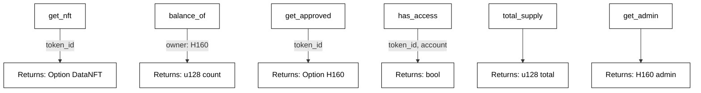

---

## 📤 Events

```mermaid
graph LR
    subgraph Events
        E1[NFTMinted<br/>token_id, owner, data_uri, privacy_level]
        E2[NFTTransferred<br/>token_id, from, to]
        E3[NFTApproved<br/>token_id, owner, approved]
        E4[AccessGranted<br/>token_id, grantee, payment]
        E5[AccessRevoked<br/>token_id, grantee]
        E6[DataURIUpdated<br/>token_id, new_uri]
        E7[AccessPriceUpdated<br/>token_id, new_price]
        E8[NFTBurned<br/>token_id, owner]
    end

    style E1 fill:#ffffff,stroke:#000000,color:#000000
    style E2 fill:#ffffff,stroke:#000000,color:#000000
    style E3 fill:#ffffff,stroke:#000000,color:#000000
    style E4 fill:#ffffff,stroke:#000000,color:#000000
    style E5 fill:#ffffff,stroke:#000000,color:#000000
    style E6 fill:#ffffff,stroke:#000000,color:#000000
    style E7 fill:#ffffff,stroke:#000000,color:#000000
    style E8 fill:#ffffff,stroke:#000000,color:#000000
```

---

## 🏗️ Data Types

### DataNFT Structure


---

## ⚙️ Access Control

```mermaid
graph TB
    subgraph "🔐 Permissions"
        A[NFT Owner] -->|Can call| A1[transfer if transferable]
        A -->|Can call| A2[approve]
        A -->|Can call| A3[grant_access 💰]
        A -->|Can call| A4[revoke_access]
        A -->|Can call| A5[update_data_uri]
        A -->|Can call| A6[update_access_price]
        A -->|Can call| A7[burn]

        B[Admin] -->|Can call| B1[revoke_access any]
        B -->|Can call| B2[burn any]

        C[Anyone] -->|Can call| C1[mint 💰]
        C -->|Can call| C2[Query functions]
    end

    style A fill:#ffffff,stroke:#000000,color:#000000
    style B fill:#ffffff,stroke:#000000,color:#000000
    style C fill:#ffffff,stroke:#000000,color:#000000
```

---

## 🎯 Minting & Access Flow

```mermaid
sequenceDiagram
    participant Alice
    participant Contract
    participant Bob

    Alice->>Contract: mint(uri, privacy=1, price, transferable) 💰
    Contract-->>Alice: NFT #1 minted ✅

    Bob->>Contract: grant_access(token_id=1, Bob) 💰
    Note over Bob: ❌ Only owner can grant

    Alice->>Contract: grant_access(token_id=1, Bob) 💰
    Contract-->>Alice: Access granted to Bob ✅

    Bob->>Contract: has_access(token_id=1, Bob)
    Contract-->>Bob: true ✅

    Alice->>Contract: revoke_access(token_id=1, Bob)
    Contract-->>Alice: Access revoked ✅

    Bob->>Contract: has_access(token_id=1, Bob)
    Contract-->>Bob: false ❌
```

---

## 🔐 Privacy Levels

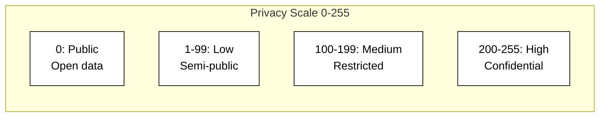

**Privacy Level Usage:**

- **0**: Public data, no restrictions
- **1-99**: Low privacy, minimal protection
- **100-199**: Medium privacy, restricted access
- **200-255**: High privacy, highly confidential

_Note: Privacy enforcement happens off-chain via access verification_

---

## 🔒 Constraints & Rules

```mermaid
graph TB
    subgraph "✅ Minting"
        A1[Anyone can mint NFTs]
        A2[Token IDs auto-increment]
        A3[Minter becomes initial owner]
    end

    subgraph "✅ Transfers"
        B1[Only owner can transfer]
        B2[Cannot transfer if is_transferable = false]
        B3[Approvals cleared on transfer]
        B4[Owner counts updated automatically]
    end

    subgraph "✅ Access Control"
        C1[Owner has automatic access]
        C2[Must pay ≥ access_price to grant]
        C3[Owner can revoke anytime]
        C4[Admin can revoke any access]
    end

    subgraph "✅ Updates"
        D1[Only owner can update data URI]
        D2[Only owner can update access price]
        D3[Settings persist across transfers]
    end

    subgraph "✅ Burning"
        E1[Owner can burn their NFT]
        E2[Admin can burn any NFT]
        E3[Burned NFTs cannot be recovered]
    end

    style A1 fill:#ffffff,stroke:#000000,color:#000000
    style A2 fill:#ffffff,stroke:#000000,color:#000000
    style A3 fill:#ffffff,stroke:#000000,color:#000000
    style B1 fill:#ffffff,stroke:#000000,color:#000000
    style B2 fill:#ffffff,stroke:#000000,color:#000000
    style B3 fill:#ffffff,stroke:#000000,color:#000000
    style B4 fill:#ffffff,stroke:#000000,color:#000000
    style C1 fill:#ffffff,stroke:#000000,color:#000000
    style C2 fill:#ffffff,stroke:#000000,color:#000000
    style C3 fill:#ffffff,stroke:#000000,color:#000000
    style C4 fill:#ffffff,stroke:#000000,color:#000000
    style D1 fill:#ffffff,stroke:#000000,color:#000000
    style D2 fill:#ffffff,stroke:#000000,color:#000000
    style D3 fill:#ffffff,stroke:#000000,color:#000000
    style E1 fill:#ffffff,stroke:#000000,color:#000000
    style E2 fill:#ffffff,stroke:#000000,color:#000000
    style E3 fill:#ffffff,stroke:#000000,color:#000000
```

---

## 🛡️ Safety Features

✅ **Owner Rights:**

- Full control over their NFTs
- Can update metadata and pricing
- Can grant/revoke access

✅ **Access Management:**

- Payment required for access grants
- Owner always has implicit access
- Granular per-NFT access control

✅ **Transfer Control:**

- NFTs can be made non-transferable
- Useful for soulbound data tokens
- Protects against unwanted transfers

✅ **Admin Oversight:**

- Admin can moderate content (burn)
- Admin can revoke malicious access
- Emergency intervention capability
