# 💰 Payment Escrow Contract

Smart contract for managing escrow payments between job owners and compute providers in the PolkadotAiMesh network.

**Status:** ✅ Builds and compiles  
**Environment:** EVM-like primitives (H160 addresses, U256 balances)

---

## 🏗️ Constructor

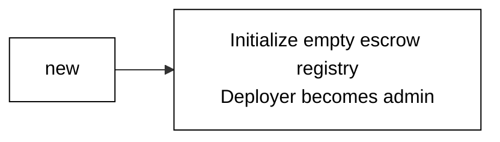

---

## 📝 Contract Functions

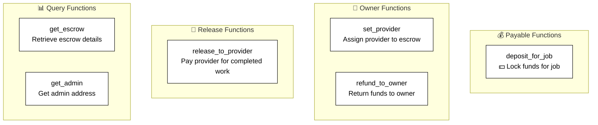

---

## 🔄 Escrow Flow

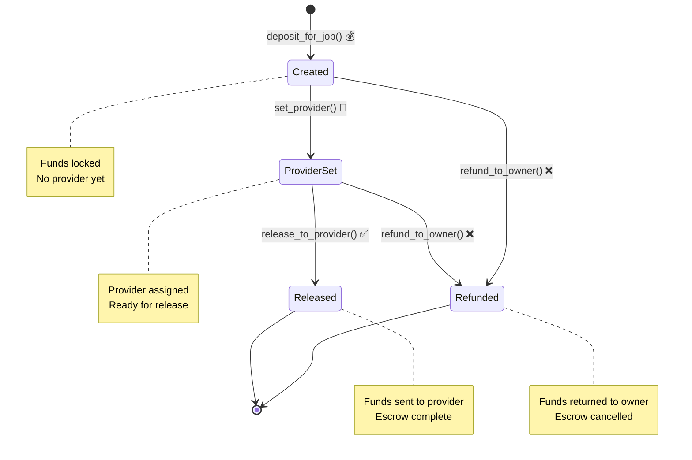

---

## 📋 Function Details

### 💰 deposit_for_job (Payable)

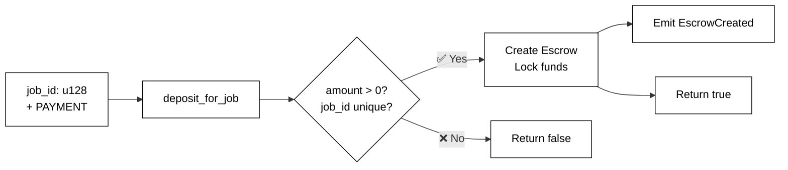

**Requirements:**

- `transferred_value > 0`
- `job_id` must not already have an escrow

---

### 👤 set_provider (Owner Only)

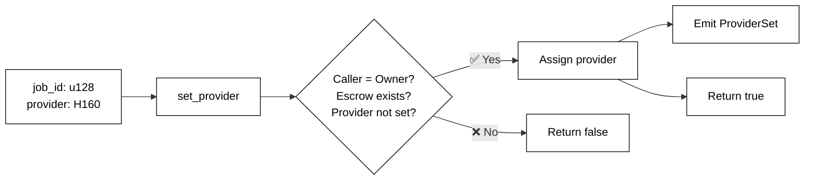

---

### ✅ release_to_provider

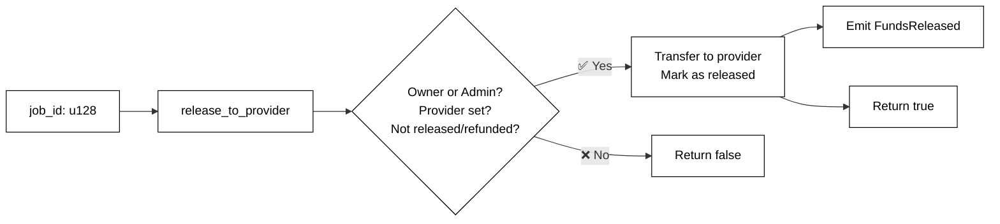

**Requirements:**

- Caller must be owner or admin
- Provider must be set
- Cannot release twice
- Cannot release after refund

---

### ❌ refund_to_owner (Owner Only)

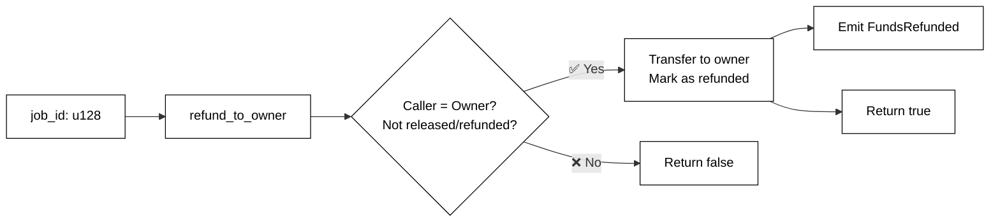

**Requirements:**

- Caller must be owner
- Cannot refund after release
- Cannot refund twice

---

## 📊 Query Functions

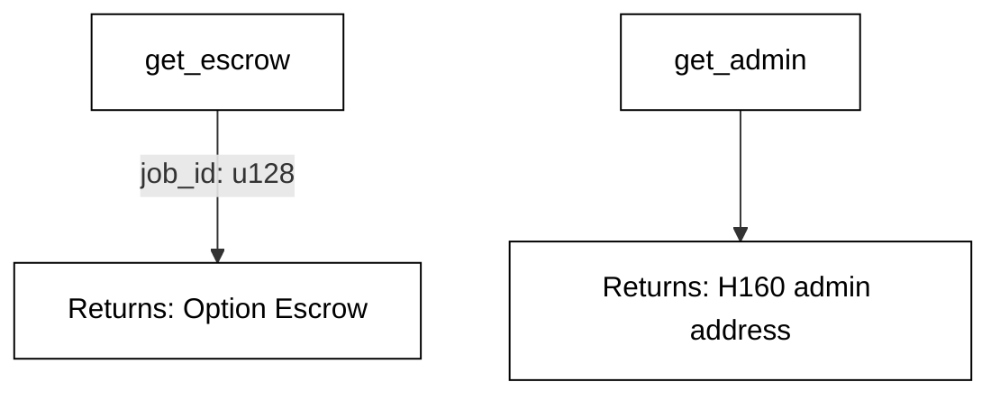

---

## 📤 Events

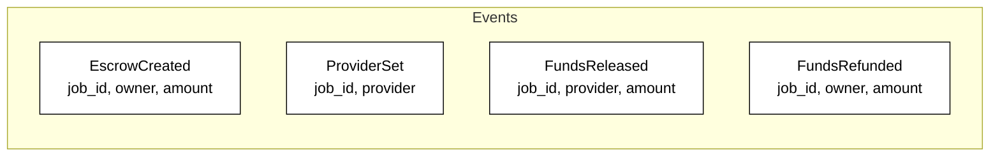

---

## 🏗️ Data Types

### Escrow Structure

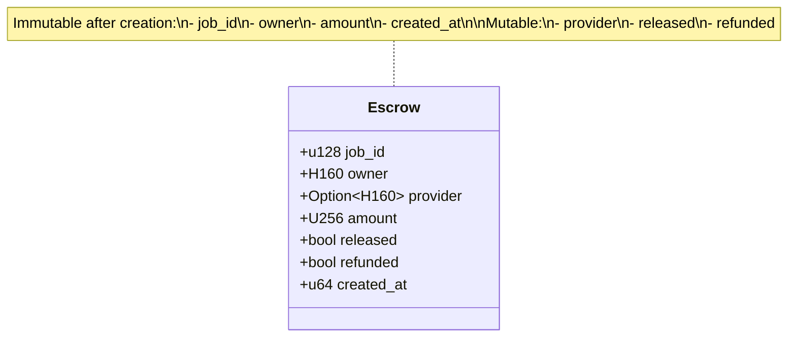

---

## ⚙️ Access Control

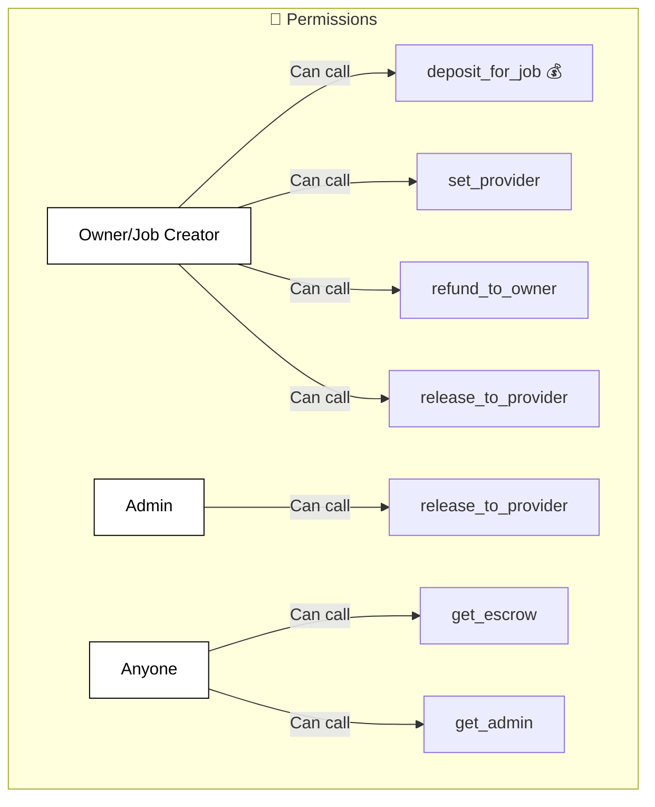

---

## 🔒 Constraints & Rules

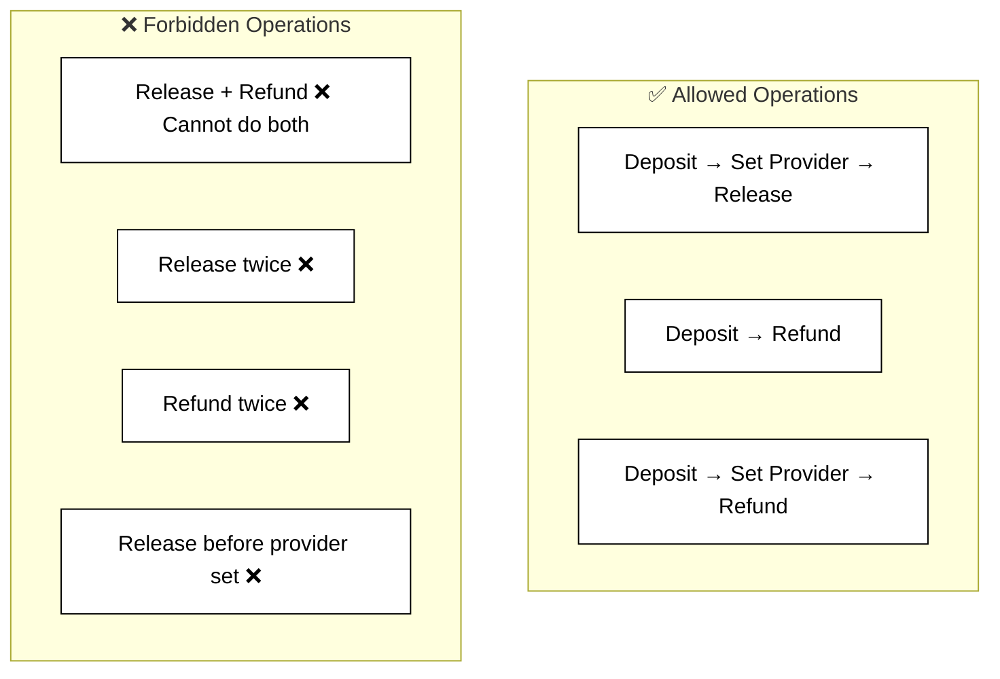

---

## 🎯 Usage Flow

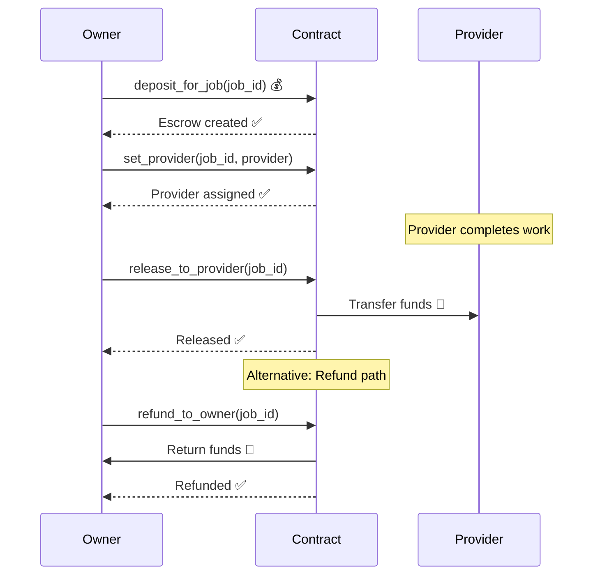

---

## 🛡️ Safety Features

✅ **Double-Payment Prevention:**

- Cannot release and refund the same escrow
- Flags (`released`, `refunded`) prevent re-execution

✅ **Authorization:**

- Only owner can set provider
- Only owner can request refund
- Only owner/admin can release funds

✅ **State Validation:**

- Cannot release without provider
- Cannot modify after finalization (release/refund)

✅ **Fund Safety:**

- Funds locked until explicit release or refund
- Transfer failures cause transaction revert
