# 💰 Payment Escrow Contract

Smart contract for managing escrow payments between job owners and compute providers in the PolkadotAiMesh network.

**Status:** ✅ Builds and compiles  
**Environment:** EVM-like primitives (H160 addresses, U256 balances)

---

## 🏗️ Constructor

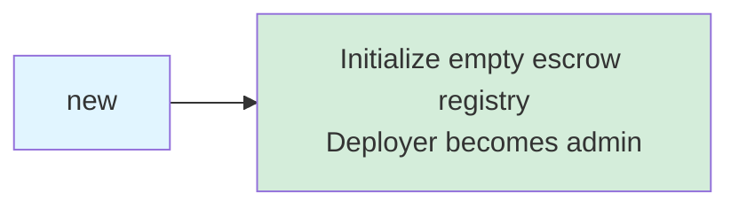

---

## 📝 Contract Functions

```mermaid
graph TB
    subgraph "💰 Payable Functions"
        A1[deposit_for_job<br/>💵 Lock funds for job]
    end
    
    subgraph "👤 Owner Functions"
        B1[set_provider<br/>Assign provider to escrow]
        B2[refund_to_owner<br/>Return funds to owner]
    end
    
    subgraph "🔧 Release Functions"
        C1[release_to_provider<br/>Pay provider for completed work]
    end
    
    subgraph "📊 Query Functions"
        D1[get_escrow<br/>Retrieve escrow details]
        D2[get_admin<br/>Get admin address]
    end
    
    style A1 fill:#fff3cd
    style B1 fill:#d1ecf1
    style B2 fill:#d1ecf1
    style C1 fill:#d4edda
    style D1 fill:#e2e3e5
    style D2 fill:#e2e3e5
```

---

## 🔄 Escrow Flow

```mermaid
stateDiagram-v2
    [*] --> Created: deposit_for_job() 💰
    Created --> ProviderSet: set_provider() 👤
    
    ProviderSet --> Released: release_to_provider() ✅
    ProviderSet --> Refunded: refund_to_owner() ❌
    Created --> Refunded: refund_to_owner() ❌
    
    Released --> [*]
    Refunded --> [*]
    
    note right of Created
        Funds locked
        No provider yet
    end note
    
    note right of ProviderSet
        Provider assigned
        Ready for release
    end note
    
    note right of Released
        Funds sent to provider
        Escrow complete
    end note
    
    note right of Refunded
        Funds returned to owner
        Escrow cancelled
    end note
```

---

## 📋 Function Details

### 💰 deposit_for_job (Payable)

```mermaid
graph LR
    A[job_id: u128<br/>+ PAYMENT] --> B[deposit_for_job]
    B --> C{amount > 0?<br/>job_id unique?}
    C -->|✅ Yes| D[Create Escrow<br/>Lock funds]
    C -->|❌ No| E[Return false]
    D --> F[Emit EscrowCreated]
    D --> G[Return true]
    
    style A fill:#e1f5ff
    style B fill:#fff3cd
    style C fill:#ffeaa7
    style D fill:#d4edda
    style E fill:#f8d7da
    style F fill:#dfe6e9
    style G fill:#d4edda
```

**Requirements:**
- `transferred_value > 0`
- `job_id` must not already have an escrow

---

### 👤 set_provider (Owner Only)

```mermaid
graph LR
    A[job_id: u128<br/>provider: H160] --> B[set_provider]
    B --> C{Caller = Owner?<br/>Escrow exists?<br/>Provider not set?}
    C -->|✅ Yes| D[Assign provider]
    C -->|❌ No| E[Return false]
    D --> F[Emit ProviderSet]
    D --> G[Return true]
    
    style A fill:#e1f5ff
    style B fill:#d1ecf1
    style C fill:#ffeaa7
    style D fill:#d4edda
    style E fill:#f8d7da
    style F fill:#dfe6e9
    style G fill:#d4edda
```

---

### ✅ release_to_provider

```mermaid
graph LR
    A[job_id: u128] --> B[release_to_provider]
    B --> C{Owner or Admin?<br/>Provider set?<br/>Not released/refunded?}
    C -->|✅ Yes| D[Transfer to provider<br/>Mark as released]
    C -->|❌ No| E[Return false]
    D --> F[Emit FundsReleased]
    D --> G[Return true]
    
    style A fill:#e1f5ff
    style B fill:#d4edda
    style C fill:#ffeaa7
    style D fill:#d4edda
    style E fill:#f8d7da
    style F fill:#dfe6e9
    style G fill:#d4edda
```

**Requirements:**
- Caller must be owner or admin
- Provider must be set
- Cannot release twice
- Cannot release after refund

---

### ❌ refund_to_owner (Owner Only)

```mermaid
graph LR
    A[job_id: u128] --> B[refund_to_owner]
    B --> C{Caller = Owner?<br/>Not released/refunded?}
    C -->|✅ Yes| D[Transfer to owner<br/>Mark as refunded]
    C -->|❌ No| E[Return false]
    D --> F[Emit FundsRefunded]
    D --> G[Return true]
    
    style A fill:#e1f5ff
    style B fill:#d1ecf1
    style C fill:#ffeaa7
    style D fill:#d4edda
    style E fill:#f8d7da
    style F fill:#dfe6e9
    style G fill:#d4edda
```

**Requirements:**
- Caller must be owner
- Cannot refund after release
- Cannot refund twice

---

## 📊 Query Functions

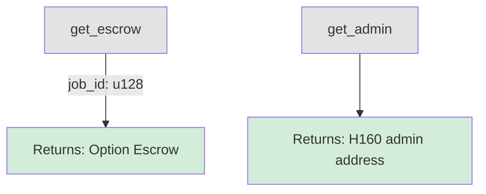

---

## 📤 Events

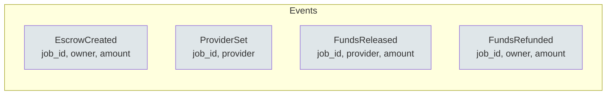

---

## 🏗️ Data Types

### Escrow Structure

---

## ⚙️ Access Control

```mermaid
graph TB
    subgraph "🔐 Permissions"
        A[Owner/Job Creator] -->|Can call| A1[deposit_for_job 💰]
        A -->|Can call| A2[set_provider]
        A -->|Can call| A3[refund_to_owner]
        A -->|Can call| A4[release_to_provider]
        
        B[Admin] -->|Can call| B1[release_to_provider]
        
        C[Anyone] -->|Can call| C1[get_escrow]
        C -->|Can call| C2[get_admin]
    end
    
    style A fill:#d1ecf1
    style B fill:#f8d7da
    style C fill:#e2e3e5
```

---

## 🔒 Constraints & Rules

```mermaid
graph TB
    subgraph "✅ Allowed Operations"
        A1[Deposit → Set Provider → Release]
        A2[Deposit → Refund]
        A3[Deposit → Set Provider → Refund]
    end
    
    subgraph "❌ Forbidden Operations"
        B1[Release + Refund ❌ Cannot do both]
        B2[Release twice ❌]
        B3[Refund twice ❌]
        B4[Release before provider set ❌]
    end
    
    style A1 fill:#d4edda
    style A2 fill:#d4edda
    style A3 fill:#d4edda
    style B1 fill:#f8d7da
    style B2 fill:#f8d7da
    style B3 fill:#f8d7da
    style B4 fill:#f8d7da
```

---

## 🎯 Usage Flow

```mermaid
sequenceDiagram
    participant Owner
    participant Contract
    participant Provider
    
    Owner->>Contract: deposit_for_job(job_id) 💰
    Contract-->>Owner: Escrow created ✅
    
    Owner->>Contract: set_provider(job_id, provider)
    Contract-->>Owner: Provider assigned ✅
    
    Note over Provider: Provider completes work
    
    Owner->>Contract: release_to_provider(job_id)
    Contract->>Provider: Transfer funds 💸
    Contract-->>Owner: Released ✅
    
    Note over Contract: Alternative: Refund path
    Owner->>Contract: refund_to_owner(job_id)
    Contract->>Owner: Return funds 💸
    Contract-->>Owner: Refunded ✅
```

---

## 🛡️ Safety Features

✅ **Double-Payment Prevention:**
- Cannot release and refund the same escrow
- Flags (`released`, `refunded`) prevent re-execution

✅ **Authorization:**
- Only owner can set provider
- Only owner can request refund
- Only owner/admin can release funds

✅ **State Validation:**
- Cannot release without provider
- Cannot modify after finalization (release/refund)

✅ **Fund Safety:**
- Funds locked until explicit release or refund
- Transfer failures cause transaction revert
